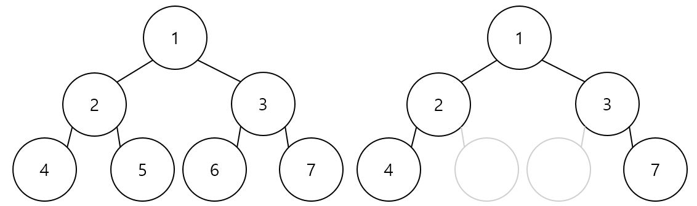
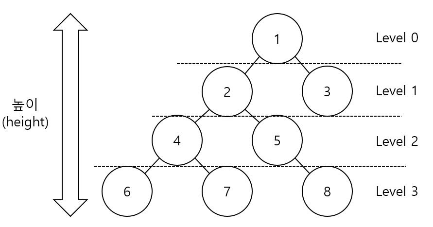
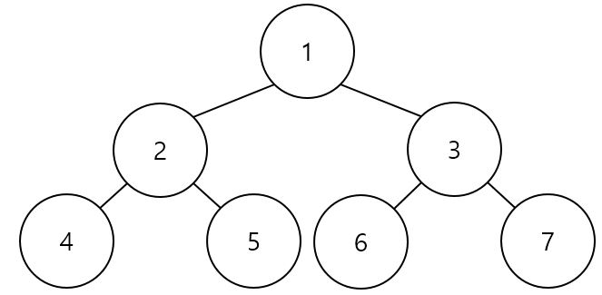
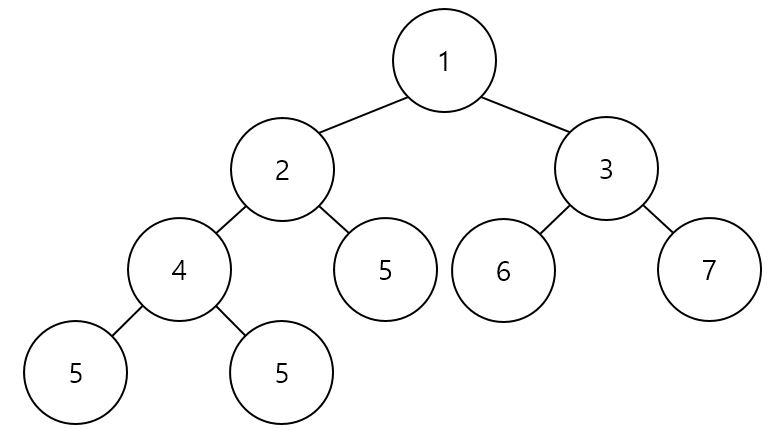
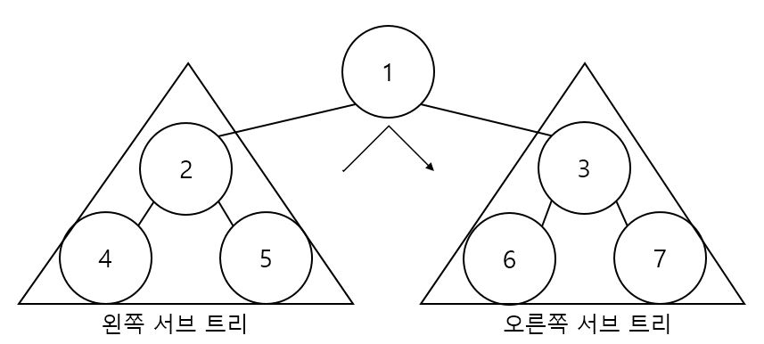
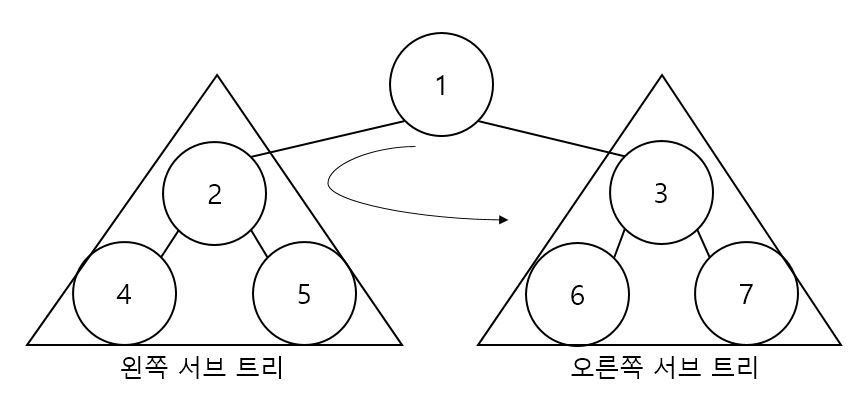
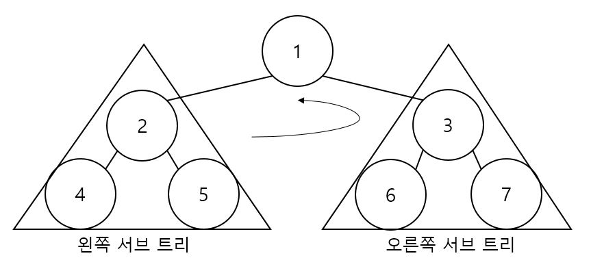

이진 트리 (Binary Tree)
======================
## 정의
----------
<center></center>

- ### 루트 노드의 서브 트리가 2개이고, 나뉜 서브 트리도 이진트리이다.
- ### 정의 자체가 재귀적이다.
- ### 공집합 노드도 포함 시킨다.

## 용어
--------
<center></center>

- ### 레벨 (level) :&nbsp;노드의 각 층, 루트 노드는 0층
- ### 높이 (height) : &nbsp;노드의 상하위 길이, 최고레벨

## 포화 이진 트리 (Full Binary Tree) vs 완전 이진 트리 (Complete Binary Tree)
-----------------------------------------------------------------------------
- ### 포화 이진 트리 (Full Binary Tree) : &nbsp;모든 레벨에 노드가 꽉 차 있는 이진 트리
<center></center>

- ### 완전 이진 트리 (Complete Binary Tree) : &nbsp; 마지막 레벨을 제외한 모든 레벨의 노드들이 꽉 차 있으며, 마지막 레벨의 노드는 왼쪽부터 채워진 이진 트리
<center></center>

## 선형 자료구조와의 차이점
---------------------------
- ### 선형자료구조는 main에서 호출하면 생성자에 의해 자동으로 모델이 구현되지만 비선형자료구조는 데이터의 저장, 출력이 아닌 모델을 만드는 쪽으로 구현

## 구현 (ADT)
--------------------------
BinaryTree.h
```C++
#pragma once
#include <iostream>
#include <functional>

using namespace std;

template <typename T>
class btree
{
private:
    T data;
    btree<T> *left = nullptr;
    btree<T> *right = nullptr;

public:
    virtual ~btree()
    {
        if(this == nullptr)
            return;
        
        delete left;
        delete right;

        delete this;
    }

    void SetData(T data)
    {
        this->data = data;
    }

    void SetLeft(btree<T> *const sub)
    {
        if (left != nullptr)
            delete this->left;

        left = sub;
    }

    void SetRight(btree<T> *const sub)
    {
        if (right != nullptr)
            delete this->right;

        right = sub;
    }

    T GetData() const { return data; }
    T GetLeft() const { return left->data; }
    T GetRight() const { return right->data; }

    void inorder(function<void(T)> action)
    {
        if(this == nullptr)
            return;
        left->inorder(action);
        action(data);
        right->inorder(action);
    }

    void preorder(function<void(T)> action)
    {
        if(this == nullptr)
            return;
        action(data);
        left->preorder(action);
        right->preorder(action);
    }

    void postorder(function<void(T)> action)
    {
        if(this == nullptr)
            return;
        left->postorder(action);
        right->postorder(action);
        action(data);
    }
};
```
BinaryTree.cpp
```C++
#include <iostream>
#include "BinaryTree.h"

using namespace std;

int main()
{
    btree<int> *b1 = new btree<int>;
    btree<int> *b2 = new btree<int>;
    btree<int> *b3 = new btree<int>;
    btree<int> *b4 = new btree<int>;
    btree<int> *b5 = new btree<int>;
    btree<int> *b6 = new btree<int>;

    b1->SetData(1);
    b2->SetData(2);
    b3->SetData(3);
    b4->SetData(4);
    b5->SetData(5);
    b6->SetData(6);

    b1->SetLeft(b2);
    b1->SetRight(b3);
    b2->SetLeft(b4);
    b2->SetRight(b5);
    b3->SetRight(b6);

    auto func = [](int data) { cout << data << ' '; };

    b1->preorder(func);
    cout << endl;
    b1->inorder(func);
    cout << endl;
    b1->postorder(func);
    
    return 0;
}
```

- ### void SetData(T data) : 데이터를 저장하는 메서드
- ### void SetLeft(btree<T> *const sub) : 왼쪽 자식노드를 연결하는 메서드
- ### void SetRright(btree<T> *const sub) : 오른쪽 자식노드를 연결하는 메서드
- ### T GetData() : 데이터를 반환하는 메서드
- ### T GetLeft() : 왼쪽 자식노드의 데이터를 반환하는 메서드
- ### T GetRight() : 오른쪽 자식노드의 데이터를 반환하는 메서드 

## 순회
----------
- ### 루트 노드를 언제 방문하는지에 따라 나뉜다.
- ### 이진 트리는 재귀적인 특징이 나타나므로 순회도 재귀를 이용한다.
- ### 재귀 탈출 조건은 더이상 노드가 없을 시, 즉 NULL일 때 이다.

- ### 중위 순회
    - #### 왼쪽 서브트리 -> 루트 노드 -> 오른쪽 서브트리
    <center></center>

- ### 전위 순회
    - #### 루트노드 -> 왼쪽 서브트리 -> 오른쪽 서브트리
    <center></center>

- ### 후위 순회
    - #### 왼쪽 서브트리 -> 오른쪽 서브트리 -> 루트노드
    <center></center>