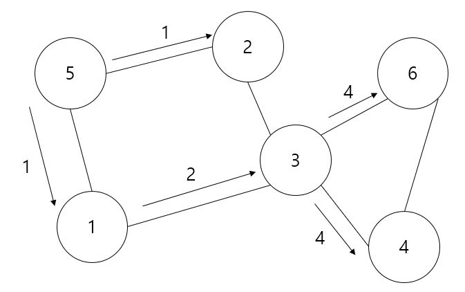

너비 우선 탐색 (BFS; Breadth First Search)
===============
BFS는 너비를 넓히는 방식으로 탐색한다. 즉, 한 정점을 탐색 후 그 다음 탐색할 정점은 탐색한 정점과 연결된 모든 정점을 한꺼번에 탐색한다. 단, 마지막 정점 탐색 후, 탐색을 진행하고나서야 탐색이 종료된다.

<center></center>

## 소스 코드 (구현)
--------
```C++
#pragma once
#include <iostream>
#include <algorithm>
#include <vector>
#include <queue>

using namespace std;

class graph
{
private:
    vector<int> *pgraph = nullptr;
    int count_edge = 0;

public:
    graph() = delete;
    graph(int vertex) { pgraph = new vector<int>[vertex]; }
    ~graph() { delete[] pgraph; }

    void add(int from_vertex, int to_vertex)
    {
        pgraph[from_vertex].push_back(to_vertex);
    }

    const int size_vertex() const { return count_edge + 1; }
    const int size_edge() const { return count_edge; }

    void bfs(const int &start)
    {
        queue<int> q;
        bool *check = new bool[count_vertex];
        fill(check, check + count_vertex, false);

        q.push(start);
        check[start] = true;

        while (!q.empty())
        {
            const int &current = q.front();
            q.pop();
            cout << current << ' ';

            vector<int>::iterator it;
            for (it = pgraph[current].begin(); it != pgraph[current].end(); it++)
            {
                int next = *it;

                if(check[next] == false)
                {
                    check[next] = true;
                    q.push(next);
                }
            }
        }
        cout << endl;

        delete[] check;
    }
};
```
BFS 탐색은 queue가 핵심이다. 탐색이 완료된 대상을 queue에 push 후, 그 다음 탐색이 될 대상을 front에서 가져온다. 만약 이미 탐색이 완료된 정점일 시 pop을 진행한다.