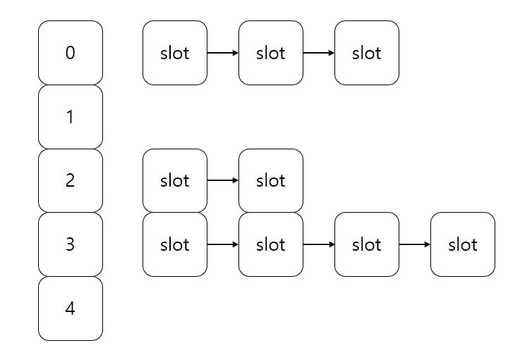

## 원리
------
닫힌 어드레싱 방법(closed addressing mehod), 즉 어떤 상황이든지 충돌이 발생해도 자신에 맞는 자리에 저장하는 방식인 테이블이다. 이 방법은 자신의 자리에 저장해야하므로, 2차원 배열이나 연결리스트를 배열로 할당하는 방식이 있다. C++에서는 list stl이 제공되므로 list를 동적할당하여 구현할 수 있다.

<center></center>

2차원 배열보다 연결 리스트를 사용하는 이유는 배열의 특성으로 인해 자원 낭비가 매우 심할 가능성이 존재하고, 연결 리스트는 길이에 가변성이 있기 때문이다.

## 소스 코드 (구현)
----------
Node.h
```C++
#pragma once
#include <iostream>
#include <utility>

using namespace std;

template <typename Key, typename Val>
class Node
{
    template <typename K, typename V>
    friend class table;

private:
    pair<Key, Val> node;

public:
    Node(const pair<Key, Val> &p) : node(p) {}

    const Key GetKey() const { return node.first; }
    const Val GetData() const { return node.second; }

public: // 연산자 오버로딩
    Node &operator=(const pair<Key, Val> &&p)
    {
        node = p;
        return *this;
    }

    const bool operator==(const Node &lnode) const
    {
        if (lnode.GetKey() == node.first)
            return true;
        else
            return false;
    }

    const bool operator==(const Key &key) const
    {
        if (key == node.first)
            return true;
        else
            return false;
    }

    friend ostream &operator<<(ostream &os, const Node &lnode)
    {
        os << lnode.GetData();
        return os;
    }
};
```
Table.h
```C++
#pragma once
#include <utility>
#include <list>
#include <functional>
#include "Node.h"

using namespace std;

template <typename Key, typename Val>
class table
{
private:
    list<Node<Key, Val>> *slot;
    function<Key(const Key key)> hash;

public: // 생성자 및 소멸자
    table() = delete;
    explicit table(const int &size)
    {
        slot = new list<Node<Key, Val>>[size];
        hash = [&](const Key key)->Key { return key % size; };
    }
    table(int size, function<Key(const Key key)> hs)
    {
        hash = hs;
        slot = new list<Node<Key, Val>>[size];
    }
    virtual ~table() = default;

public:
    void insert(const pair<Key, Val> &p)
    {   
        if(find(p.first) != nullptr)
        {
            cout << "ERROR: Overlap" << endl;
            return;
        }
        else
        {
            Node<Key, Val> newNode(p);
            slot[hash(p.first)].push_front(newNode);
        }
    }

    void erase(const Key &key)
    {
        const Key hs = hash(key);
        typename list<Node<Key, Val>>::iterator it;

        for (it = slot[hs].begin(); it != slot[hs].end(); it++)
        {
            if(*it == key)
                break;
        }
        slot[hs].erase(it);
    }

    const Val *find(const Key &key) const
    {
        const Key hs = hash(key);
        typename list<Node<Key, Val>>::iterator it;

        for (it = slot[hs].begin(); it != slot[hs].end(); it++)
        {
            if(*it == key)
            {
                static Node<Key, Val> delNode = *it;
                return &delNode.node.second;
            }
        }

        return nullptr;
    }
};
```
Table.cpp
```C++
#include <iostream>
#include <utility>
#include "Table.h"

using namespace std;

int main()
{
    table<int, char> t(10);

    t.insert(make_pair(1, 'a'));
    t.insert(make_pair(2, 'a' + 1));
    t.insert(make_pair(3, 'a' + 2));
    t.insert(make_pair(4, 'a' + 3));
    t.insert(make_pair(5, 'a' + 4));
    t.insert(make_pair(16, 'a' + 15));
    t.insert(make_pair(15, 'a' + 14));
    t.insert(make_pair(13, 'a' + 12));

    const char *result = t.find(2);
    cout << *result << endl;

    return 0;
}
```