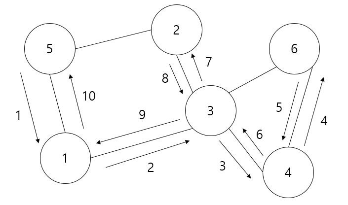

깊이 우선 탐색 (DFS; Depth First Search)
==============
DFS는 아래 조건 3가지를 충족하는 그래프 탐색 방법이다.
- #### 정점를 하나씩 탐색한다.
- #### 탐색할 정점이 없을 시 그 전 노드를 탐색한다.
- #### 처음 탐색한 정점에서 탐색이 종료된다.

<cemter></center>

DFS 탐색 구현
---------
```C++
#pragma once
#include <iostream>
#include <algorithm>
#include <vector>
#include <stack>

using namespace std;

class graph
{
private:
    vector<int> *pgraph = nullptr;
    int count_edge = 0;

public:
    graph() = delete;
    graph(int vertex) { pgraph = new vector<int>[vertex]; }
    ~graph() { delete[] pgraph; }

    void add(int from_vertex, int to_vertex)
    {
        pgraph[from_vertex].push_back(to_vertex);
    }

    const int size_vertex() const { return count_edge + 1; }
    const int size_edge() const { return count_edge; }

    void dfs(const int &start) // DFS 탐색
    {
        stack<int> s;
        bool *check = new bool[count_vertex];
        fill(check, check + count_vertex, false);

        cout << start << ' ';
        s.push(start);
        check[start] = true;

        while (!s.empty())
        {
            const int &current = s.top();
            s.pop();

            vector<int>::iterator it;
            for (it = pgraph[current].begin(); it != pgraph[current].end(); it++)
            {
                int next = *it;

                if(check[next] == false)
                {
                    cout << next << ' ';
                    check[next] = true;

                    s.push(next);
                    s.push(current);
                    break;
                }
            }
        }
        cout << endl;

        delete[] check;
    }
};
```
DFS 탐색 시 가장 핵심은 스택(stack)을 사용한다는 것이다. 탐색이 완료된 정점을 스택에 push한 후 top에 있는 정점이 탐색의 대상이 된다. 이미 탐색된 대상일 시 pop을 진행한다. 스택이 비어있으면 탐색이 종료된다.