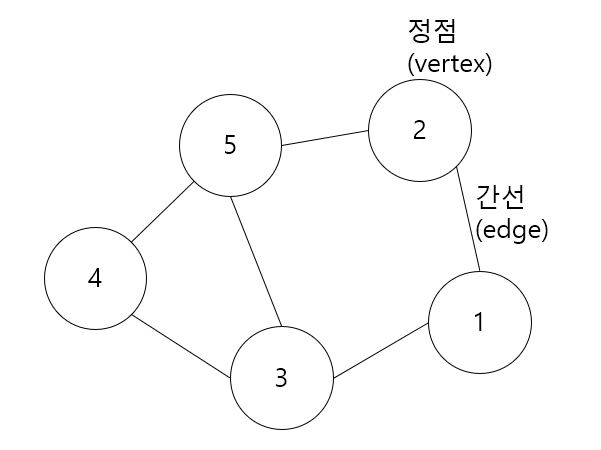
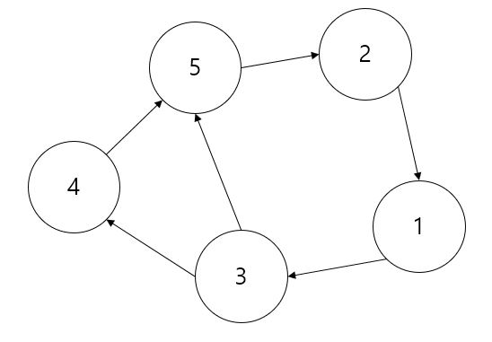
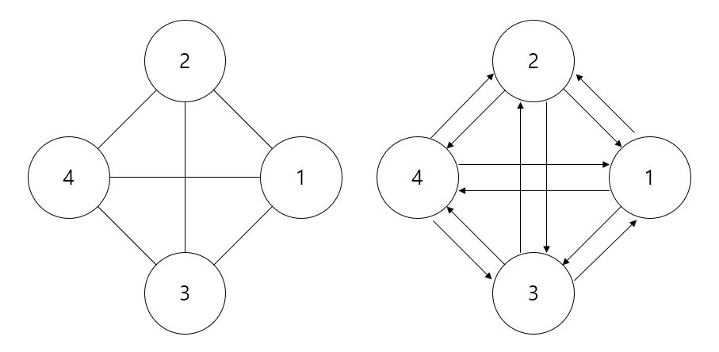
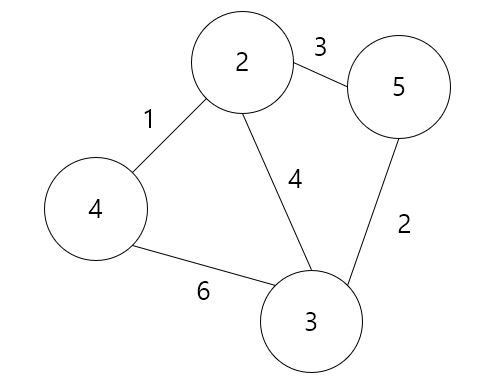
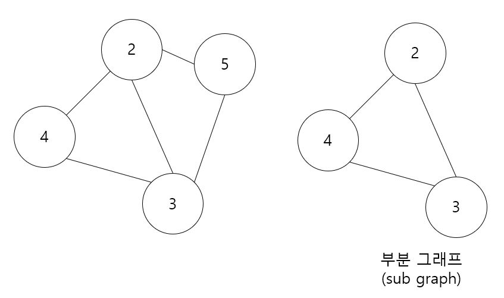
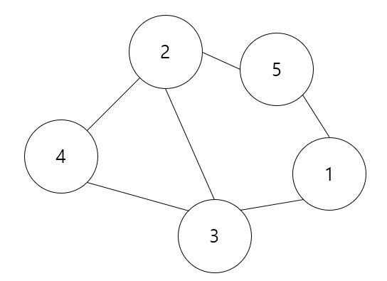

그래프 (Graph)
=========
## 구조
-----------
그래프는 **정점(vertex)**과 **간선(edge)**으로 이루어진 구조이다. 이는 지하철의 노선도와 비슷한 개념이다. 지하철의 노선도처럼 정점과 정점사이의 최적의 경로를 알 수도 있다.

<center></center>

## 종류
---------
- ### 방향 그래프 (directed graph); 다이그래프 (digraph)
    - #### 방향에 대한 정보가 그려진 그래프이다.
    - #### 이와 반대로 방향이 없는 무방향 그래프(undirected graph)가 있다.

    <center></center>

- ### 완전 그래프 (complete graph)
    - #### 모든 정점이 자신을 제외한 모든 정점을 연결한 그래프이다.
    - #### 방향 그래프는 모든 정점을 가리켜야하므로 두 정점당 2개의 간선이 나타난다.

    <center></center>

- ### 가중치 그래프 (weight graph)
    - #### 간선에 가중치에 대한 정보를 표시하여 구성한 그래프이다.
    - #### 가중치의 의미는 이동시간으로 둘 수도 있고, 그 외의 정보로 설정할 수도 있다.

    <center></center>

- ### 부분 그래프 (sub graph)
    - #### 그래프의 일부만 표현한 그래프이다.

    </cneter></center>

## 표현
------
- ### 무방향 그래프의 표현

<center></center>

> 정점 : V(G) = {1, 2, 3, 4, 5} (G는 그래프 이름)  
> 간선 : E(G) = {(4, 2), (4, 3), (2, 5), (5, 1), (3, 1), (2, 3)} (G는 그래프 이름)

- ### 방향 그래프의 표현

<center></center>

> 정점 : V(G) = {1, 2, 3, 4, 5} (G는 그래프 이름)  
> 간선 : E(G) = {<3, 4>, <4, 5>, <3, 5>, <5, 2>, <2, 1>, <1, 3>} (G는 그래프 이름)  
> <A, B> : A가 B를 가리키는 간선

## 소스 코드 (구현)
-------
 Graph.h
 ```C++
 #pragma once
#include <iostream>
#include <vector>

using namespace std;

class graph
{
private:
    vector<pair<int, int>> *pgraph = nullptr;
    int count_edge = 0;

public:
    graph() = delete;
    graph(int vertex) { pgraph = new vector<pair<int, int>>[vertex]; }
    ~graph() { delete[] pgraph; }

    void add(int from_vertex, int to_vertex)
    {
        pgraph[from_vertex].push_back(to_vertex);
    }

    void show() const
    {
        for (int i = 0; i < count_edge + 1; i++)
        {
            if(pgraph[i].empty())
            {
                cout << i << "is nothing connected" << endl;
                continue;
            }
            typename vector<int>::iterator it;
            cout << i << " is connected with";
            for (it = pgraph[i].begin(); it != pgraph[i].end(); it++)
            {
                cout << ' ' <<  *it;
                if(it == pgraph[i].end() - 1)
                    break;
                cout << ',';
            }
            cout << endl;
        }
    }

    const int size_vertex() const { return count_edge + 1; }
    const int size_edge() const { return count_edge; }
};
 ```
 Graph.cpp
 ```C++
 #include <iostream>
#include "Graph.h"

using namespace std;

int main()
{
    graph g(5);

    g.add(0, 1);
    g.add(0, 3);
    g.add(1, 2);
    g.add(2, 3);
    g.add(3, 4);
    g.add(4, 0);

    g.show();

    return 0;
}
 ```