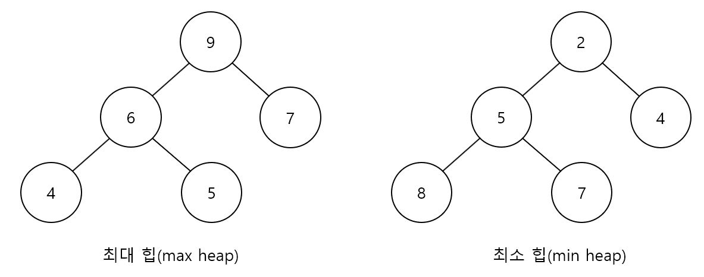
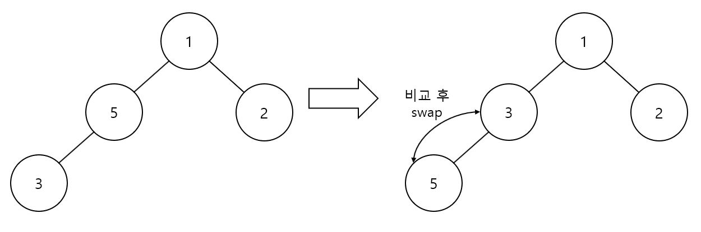
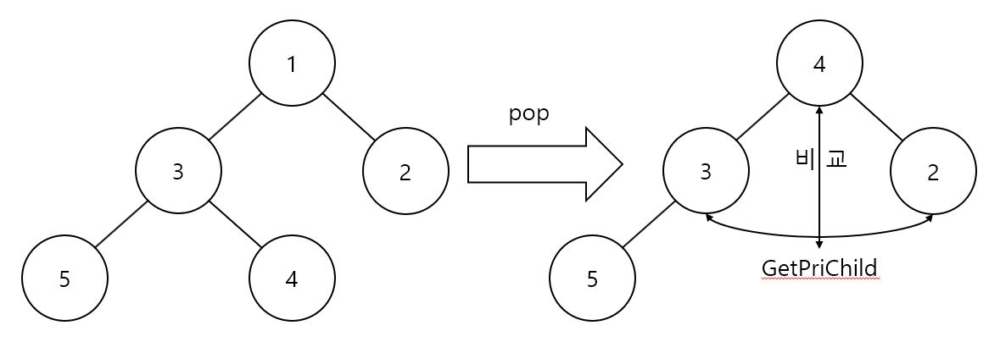

힙 (Heeap)
================
## 개념
---------
- ### 완전 이진 트리이다.
- ### 자식 노드의 키값과 부모 노드의 키값은 대소관계를 가진다.
- ### 부모 노드의 키값이 자식 노드의 키값보다 클 시 최대 힙(max heap)이라 부르고 반대일 시 최소 힙(min heap)라고 부른다.
<center></center>

- ### 노드 값을 얻는 법
    - #### 왼쪽 자식 노드 값 -> index * 2
    - #### 오른쪽 자식 노드 값 -> index * 2 + 1
    - #### 부모 노드 값 -> index / 2

## 장점
--------
- ### push와 pop을 진행할 시 시간 복잡도는 )이다. 하지만 연결리스트를 이용할 시 O(n)이다. 즉 힙의 속도가 더욱 빠르다. -> 우선순위 큐를 힙으로 구현하는 이유이다.
    - #### 시간복잡도가 )인 이유는 트리의 높이만큼 연산을 수행하기 때문이다. 이진 트리이므로 데이터가 2배 늘어날 시 연산횟수는 1회 증가한다.

## 소스 코드 (구현)
-------------------
Heap.h
```C++
#pragma once
#include <iostream>
#include <functional>

using namespace std;

template <typename T>
class heap
{
private:
    int length = 0;
    T array[100];
    function<int(T,T)> comp;

public:
    heap() = delete;
    heap(function<int(T,T)> cp) // 정렬방식 저장
    {
        length = 0;
        comp = cp; 
    }

    bool empty() const
    {
        if(length == 0)
            return true;
        else
            return false;
    }

    void push(T data)
    {
        if(length >= 100)
        {
            cout << "ERROR: Memory Is Full" << endl;
            exit(-1);
        }

        int idx = length + 1;

        while (idx != 1)
        {
            if(comp(data, array[idx / 2]) > 0)
            {
                array[idx] = array[idx / 2];
                idx /= 2;
            }
            else
                break;
        }

        array[idx] = data;
        length += 1;
    }
    void pop()
    {
        if(empty())
        {
            cout << "ERROR: Memory Is Not Exist" << endl;
            exit(-1);
        }
        T lastNode = array[length];

        int parentIdx = 1;
        int childIdx;

        while (childIdx = GetPriChild(parentIdx))
        {
            if(comp(lastNode, array[childIdx]) >= 0)
                break;
            array[parentIdx] = array[childIdx];
            parentIdx = childIdx;
        }

        array[parentIdx] = lastNode;
        length -= 1;
    }

    T operator[](int idx) const { return array[idx]; }
    int size() const { return length; }

private:
    int GetPriChild(int idx) const // 우선 순위가 높은 자식 노드를 반환
    {
        if(idx * 2 > length)
            return 0;
        else if(idx * 2 == length)
            return idx * 2;
        else
        {
            if(comp(array[idx * 2], array[idx * 2 + 1]) < 0)
                return idx * 2 + 1;
            else
                return idx * 2;
        }
    }
};
```
Heap.cpp
```C++
#include <iostream>
#include "Heap.h"

using namespace std;

int main()
{
    auto func = [](int data1, int data2)->int { return data2 - data1; };
    heap<int> h(func);

    h.push(1);
    h.push(5);
    h.push(2);
    h.push(3);
    h.push(4);

    for (int i = 1; i <= h.size(); i++)
    {
        cout << h[i] << ' ';
    }
    cout << endl;
    
    while (!h.empty())
        h.pop();
    
    return 0;
}
```

- ### ADT와 원리
    > #### bool empty()
    #### length = 0일 시 힙(Heap)은 비어있음
    > #### void push(T data)
    #### 마지막 노드에 추가한 후 부모 노드와 비교하면서 자리를 찾음
    <center></center>

    > #### void pop()
    #### 루트 노드를 삭제 후 마지막 노드를 루트 노드로 이동시켜 자식 노드 중 우선순위가 높은 노드(GetPriChild)와 비교하면서 자리를 찾음
    <center></center>

    > #### int size() const
    #### 채워져있는 노드의 개수를 반환