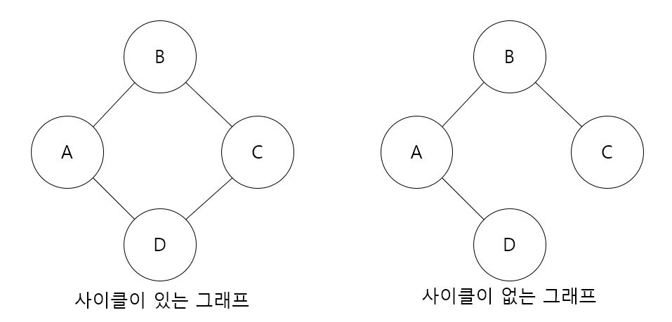
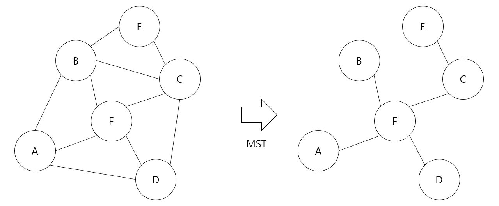
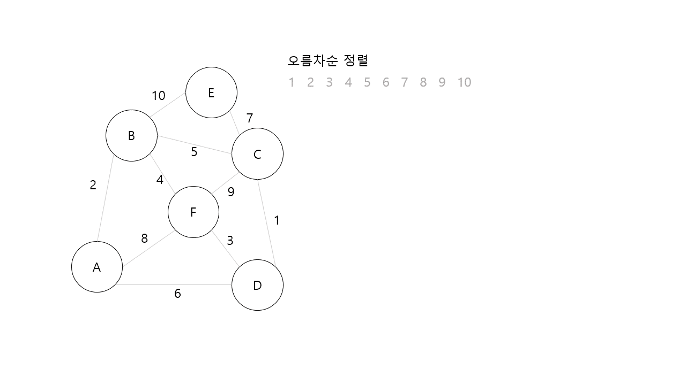
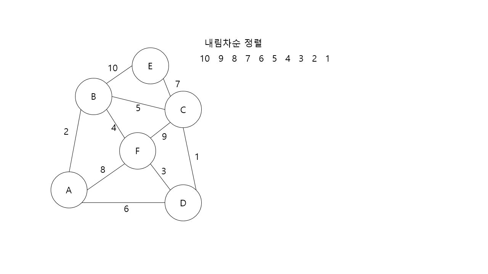

최소 비용 신장 트리 (Minimum cost Spanning Tree; MST)
=============
## 단순 경로 (Simple path)와 사이클 (Cycle)
------------
- ### 단순 경로 (Simple path) : 경로 중 간선이 중복되지 않을 시 단순 경로라고 불린다. (ex. A-D-B-C, A-D-B-D-A-C는 A와 D를 잇는 간선이 중복되어 단순 경로가 될 수 없다.)
- ### 사이클 : 단순 경로이면서 시작 정점과 끝 정점이 같은 경로

## 원리
---------
최소 비용 트리(MST)는 아래 2가지 조건을 충족해야한다.
> 모든 정점이 하나의 간선으로 연결되어야 합니다.  
> 사이클이 형성되지 않아야 합니다.

- ### MST는 간선의 수가 정점의 수보다 하나 적다는 특징이 있다. (간선의 수 + 1 = 정점의 수)
- ### MST를 구성하는 알고리즘은 크루스칼(kruskal) 알고리즘과 프림(prime) 알고리즘이 있다.
- ### MST를 사용하는 이유는 가장 적은 간선으로 모든 정점을 탐색할 수 있기 때문에 네트워크 구축에 많이 사용된다. (ex. 가장 적은 케이블로 연락망을 구축)

## 크루스칼 알고리즘 (Kruskal Algorithm)
----------------------------
- ### 원리 : 가중치를 기준으로 정렬 후 MST의 조건이 부합될 때까지 간선을 선택 후 삭제 또는 차례대로 삭제한다.

1. 간선을 선택하는 방식

- ### 원리 : 가중치를 중심으로 **오름차순** 정렬 후 간선을 하나씩 선택한다. 사이클이 형성되는지 확인하면서 진행한다. 이후 선택되지 않은 간선들은 모두 삭제한다.

2. 간선을 삭제하는 방식

- ### 원리 : 가중치를 중심으로 내림차순정렬 후 간선을 하나씩 삭제한다. 간선이 정점과 하나 이상 연결되어 있는지 확인하며 진행한다.

