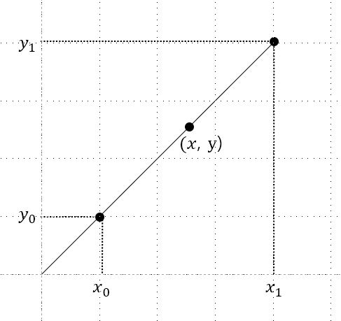
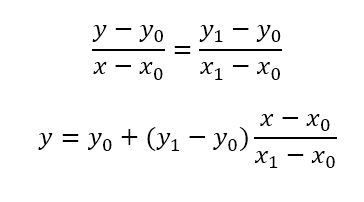

탐색 .ver 2.0
=====
## 보간 탐색 (Interpolation Search)
----------------
- ### 원리
    - #### 이진 탐색에서 사용한 중앙부터 탐색하는 것이 아닌 선형 보간법(linear interpolation)을 이용한 탐색 방법이다. 선형 보간법이란 어떠한 두 점 사이에 위치한 한 점을 추정하기 위해 선형적으로 계산하는 방법이다
    <center></center>

    위 사진에서 (x, y)를 구하기 위해서는 다음과 같은 비례식을 세워 구할 수 있다.
    
    <center></center>

    위 식이 알려진 두 점 사이에서 추정되는 점이다. 이 점을 기준점으로 잡아 탐색을 진행한다.

- ### 소스 코드 (구현)
```C++
#include <iostream>

using namespace std;

template <typename T>
T *interpolation_search(T *start, T *end, const T &target)
{
    if(*start > target || *end < target)
        return nullptr;

    T *mid = ((target - *start) / (*end - *start) * (end - start)) + start;

    if(*mid == target)
        return mid;
    else if(target < *mid)
        return interpolation_search(start, mid - 1, target);
    else
        return interpolation_search(mid + 1, end, target);
}

int main()
{
    int arr[] = {1, 3, 4, 7, 9};
    int *result;

    result = interpolation_search(arr, arr + 4, 2);

    if(result == nullptr)
        cout << "ERROR: Search Fail" << endl;
    else
        cout << *result << endl;

    return 0;
}
```