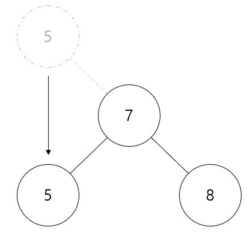

탐색 .ver 2.0
=====
## 보간 탐색 (Interpolation Search)
----------------
- ### 원리
    - #### 이진 탐색에서 사용한 중앙부터 탐색하는 것이 아닌 선형 보간법(linear interpolation)을 이용한 탐색 방법이다. 선형 보간법이란 어떠한 두 점 사이에 위치한 한 점을 추정하기 위해 선형적으로 계산하는 방법이다
    <center></center>

    위 사진에서 (x, y)를 구하기 위해서는 다음과 같은 비례식을 세워 구할 수 있다.
    
    <center></center>

    위 식이 알려진 두 점 사이에서 추정되는 점이다. 이 점을 기준점으로 잡아 탐색을 진행한다.

- ### 소스 코드 (구현)
```C++
#include <iostream>

using namespace std;

template <typename T>
T *interpolation_search(T *start, T *end, const T &target)
{
    if(*start > target || *end < target)
        return nullptr;

    T *mid = ((target - *start) / (*end - *start) * (end - start)) + start;

    if(*mid == target)
        return mid;
    else if(target < *mid)
        return interpolation_search(start, mid - 1, target);
    else
        return interpolation_search(mid + 1, end, target);
}

int main()
{
    int arr[] = {1, 3, 4, 7, 9};
    int *result;

    result = interpolation_search(arr, arr + 4, 2);

    if(result == nullptr)
        cout << "ERROR: Search Fail" << endl;
    else
        cout << *result << endl;

    return 0;
}
```

## 이진 탐색 트리 (Binary Search Tree)
---------
- ### 원리
    - #### 이진 트리 (Binary Tree)에서 저장 방식에 대한 규칙을 추가하여 만든 트리이다. 저장 방식에 대한 규칙은 다음과 같다.
    > - 키(Key)는 중복되지 않는다.
    > - 어떠한 노드의 키(key)는 왼쪽 서브 트리의 키(key)보다 크다.
    > - 어떠한 노드의 키(key)는 오른쪽 서브 트리의 키(key)보다 작다.

    <center></center>

    - #### insert (삽입)
        - ##### 루트 노드부터 비교하면서 작으면 왼쪽 서브트리로 크면 오른쪽 서브트리로 가 NULL값이 있는 곳으로 이동하여 연결한다.

        <center></center
        
    - #### erase (삭제)
        - ##### 삭제 노드가 단말노드인 경우
            - ###### 부모 노드의 자식 노드를 제거하는 방식으로 진행한다.

            <center></center>

        - ##### 삭제 노드가 하나의 자식 노드를 갖는 경우
            - ###### 자식 노드를 확인한 후 부모 노드와 자식 노드를 연결해 진행한다.

            <center></center>

        - ##### 삭제 노드가 두 개의 자식 노드를 갖는 경우
            - ###### 오른쪽 자식 노드로 대체해 진행한다.

            <center></center>

            <center></center>

- ### 소스 코드 (구현)
    - #### Node.h
    ```C++
    #pragma once
    #include <utility>

    using namespace std;

    template <typename Key, typename Val>
    class Node
    {
        template <typename T, typename U>
        friend class BST;

    private:
        pair<Key, Val> node;
        Node<Key, Val> *left = nullptr;
        Node<Key, Val> *right = nullptr;

    public:
        ~Node() = default;
        Key GetKey() const { return node.first; }
        Val GetData() const { return node.second; }

        void SetLeft(Node<Key, Val> *const sub)
        {
            if (left != nullptr)
                delete this->left;

            left = sub;
        }

        void SetRight(Node<Key, Val> *const sub)
        {
            if (right != nullptr)
                delete this->right;

            right = sub;
        }

        void ChangeLeft(Node<Key, Val> *const sub) { left = sub; }
        void ChangeRight(Node<Key, Val> *const sub) { right = sub; }

        Node *RemoveLeft()
        {
            Node<Key, Val> *delNode = nullptr;

            if(this != nullptr)
            {
                delNode = left;
                left = nullptr;
            }

            return delNode;
        }

        Node *RemoveRight()
        {
            Node<Key, Val> *delNode = nullptr;

            if(this != nullptr)
            {
                delNode = right;
                right = nullptr;
            }

            return delNode;
        }
    };
    ```
    - #### BinarySearchTree.h
    ```C++
    #pragma once
    #include <iostream>
    #include <utility>
    #include "Node.h"

    using namespace std;

    template <typename Key, typename Val>
    class BST
    {
    private:
        Node<Key, Val> *root = nullptr;

    public:
        ~BST() = default;
        void insert(const pair<Key, Val> &p)
        {
            Node<Key, Val> *newNode = new Node<Key,Val>;
            newNode->node = p;

            if(root == nullptr)
            {
                root = newNode;
                return;
            }

            Node<Key,Val> *curNode = root;
            Node<Key, Val> *parNode = nullptr;
            while (curNode != nullptr)
            {
                if(p.first == curNode->GetKey())
                {
                    cout << "ERROR: Overlap" << endl;
                    exit(-1);
                }

                parNode = curNode;

                if(curNode->GetKey() > p.first)
                    curNode = curNode->left;
                else
                    curNode = curNode->right;
            }

            if(parNode->GetKey() > p.first)
                parNode->left = newNode;
            else
                parNode->right = newNode;
        }

        void erase(Key target)
        {
            Node<Key, Val> *parNode = nullptr;
            Node<Key, Val> *curNode = root;

            while (curNode != nullptr && curNode->GetKey() != target)
            {
                parNode = curNode;

                if(target < curNode->GetKey())
                    curNode = curNode->left;
                else
                    curNode = curNode->right;
            }

            if(curNode == nullptr)
            {
                cout << "ERROR: Memory Does Not Exist" << endl;
                exit(-1);
            }

            Node<Key, Val> *delNode = curNode;

            if(delNode->left == nullptr && delNode->right == nullptr) // 단말 노드인 경우
            {
                if(parNode->left == delNode)
                    parNode->RemoveLeft();
                else
                    parNode->RemoveRight();
            }

            else if(delNode->left == nullptr || delNode->right == nullptr) // 자식 노드가 하나인 경우
            {
                Node<Key, Val> *childNode = nullptr;

                if(delNode->left != nullptr)
                    childNode = delNode->left;
                else
                    childNode = delNode->right;

                if(parNode->left == delNode)
                    parNode->ChangeLeft(childNode);
                else
                    parNode->ChangeRight(childNode);
            }

            else // 자식 노드가 2개인 경우
            {
                Node<Key, Val> *rNode = delNode->right;
                Node<Key, Val> *rParNode = delNode;

                while (rNode->left != nullptr)
                {
                    rParNode = rNode;
                    rNode = rNode->left;
                }

                delNode->node = rNode->node;

                if(rParNode->left == rNode)
                    rParNode->ChangeLeft(rNode->left);
                else
                    rParNode->ChangeRight(rNode->right);

                delNode = rNode;
            }

            Node<Key, Val> *vRoot = new Node<Key, Val>;
            vRoot->SetRight(root);

            if(vRoot->right != root)
                root = vRoot->right;

            delete vRoot;
            delete delNode;
        }

        Val *find(const Key &key)
        {
            Node<Key, Val> *curNode = root;
            Key curKey;

            while (curNode != nullptr)
            {
                curKey = curNode->GetKey();

                if(key == curKey)
                    return &curNode->node.second;
                else if(key < curKey)
                    curNode = curNode->left;
                else
                    curNode = curNode->right;
            }

            return nullptr;
        }

        Val &operator[](const Key &&key) { return *find(key); }
        Val &operator[](const Key &key) { return *find(key); }
    };
    ```
    - #### BinarySearchTree.cpp
    ```C++
    #include <iostream>
    #include <utility>
    #include "BinarySearchTree.h"

    using namespace std;

    int main()
    {
        BST<int, char> b;

        b.insert(make_pair(3, 'a' + 2));
        b.insert(make_pair(5, 'a' + 4));
        b.insert(make_pair(1, 'a'));
        b.insert(make_pair(4, 'a' + 3));
        b.insert(make_pair(7, 'a' + 6));
        b.insert(make_pair(2, 'a' + 1));
        b.insert(make_pair(6, 'a' + 5));

        for (int i = 1; i < 8; i++)
        {
            cout << b[i]  << ' ';
        }
        cout << endl;

        return 0;
    }
    ```

- ### 성능
    - #### 이진 트리의 탐색 연산은 트리의 높이만큼 수행되므로 O(log_2 n)의 시간 복잡도를 가진다. 하지만, 트리의 균형이 불균형할수록 O(n)의 시간 복잡도를 가진다.

## AVL 트리
--------
- ### 원리
    - #### 이진 트리 탐색 (Binary Search Tree)는 최악의 경우 O(n)이라는 시간 복잡도를 가진다. 이를 대비하여 트리를 꾸준하게 리밸런(Rebalancing을 해줘야하고, 그로 인해 나온 트리 중 하나가 AVL Tree이다.

    > 균형 인수 : 왼쪽 서브 트리의 높이 - 오른쪽 서브 트리의 높이

    - #### 리밸런싱을 진행할 시 균형인수의 절댓값이 2이상이여야 합니다.

    - #### LL 회전
    <center></center>
    <center></center>

    - #### RR 회전
    <center></center>
    <center></center>

    - #### LR 회전
    <center></center>
    <center></center>

    - #### RL 회전
    <center></center>
    <center></center>

- ### ADT
    - #### insert(삽입) : root노드의 key값과 비교하여, 서브트리로 이동한다. 서브트리로 이동 시 각 노드마다 리밸런싱을 진행하여 알맞는 노드의 자리를 찾는 작업을 진행한다.

    - #### erase(삭제)
        - ##### 자식 노드가 없을 때 : target의 부모 노드의 자식 노드를 null로 바꾼 뒤 target을 delete한다.
        - ##### 자식 노드가 하나일 때 : target의 부모 노드와 자식 노드를 이어 주고 target을 delete한다.
        - ##### 자식 노드가 2개일 때 : target의 오른쪽 서브 트리 중 가장 작은 값을 부모 노드와 연결 후 target을 delete한다.

    - #### find(탐색) : root노드부터 key됴값을 비교하면서 서브트리로 이동한다. target값과 같을 시 target의 value의 주소를 반환한다.

- ### 소스 코드 (구현)
Node.h
```C++
#pragma once
#include <utility>

using namespace std;

template <typename Key, typename Val>
class Node
{
    template <typename T, typename U>
    friend class AVL;

private:
    pair<Key, Val> node;
    Node<Key, Val> *left = nullptr;
    Node<Key, Val> *right = nullptr;

public:
    virtual ~Node() = default;
    Key GetKey() const { return node.first; }
    Val GetData() const { return node.second; }

private:
    void SetLeft(Node<Key, Val> *const sub)
    {
        if (left != nullptr)
            delete this->left;

        left = sub;
    }

    void SetRight(Node<Key, Val> *const sub)
    {
        if (right != nullptr)
            delete this->right;

        right = sub;
    }

    void ChangeLeft(Node<Key, Val> *const sub) { left = sub; }
    void ChangeRight(Node<Key, Val> *const sub) { right = sub; }

    Node *RemoveLeft()
    {
        Node<Key, Val> *delNode = nullptr;

        if(this != nullptr)
        {
            delNode = left;
            left = nullptr;
        }

        return delNode;
    }

    Node *RemoveRight()
    {
        Node<Key, Val> *delNode = nullptr;

        if(this != nullptr)
        {
            delNode = right;
            right = nullptr;
        }

        return delNode;
    }

    const int GetHeight() const
    {
        if(this == nullptr)
            return 0;

        const int left_height = left->GetHeight();
        const int right_height = right->GetHeight();

        if(left_height > right_height)
            return left_height + 1;
        else
            return right_height + 1;
    }

    const int GetHighDiff() const
    {
        if(this == nullptr)
            return 0;

        const int left_sub_height = left->GetHeight();
        const int right_sub_height = right->GetHeight();

        return left_sub_height - right_sub_height;
    }

    Node *RotateLL()
    {
        Node<Key, Val> *parNode = this;
        Node<Key, Val> *curNode = parNode->left;

        parNode->ChangeLeft(curNode->right);
        curNode->ChangeRight(parNode);

        return curNode;
    }

    Node *RotateRR()
    {
        Node<Key, Val> *parNode = this;
        Node<Key, Val> *curNode = parNode->right;

        parNode->ChangeRight(curNode->left);
        curNode->ChangeLeft(parNode);

        return curNode;
    }

    Node *RotateLR()
    {
        Node<Key, Val> *parNode = this;
        Node<Key, Val> *curNode = parNode->left;

        parNode->ChangeLeft(curNode->RotateRR());

        return parNode->RotateLL();
    }

    Node *RotateRL()
    {
        Node<Key, Val> *parNode = this;
        Node<Key, Val> *curNode = parNode->right;

        parNode->ChangeRight(curNode->RotateLL());

        return parNode->RotateRR();
    }

    void Print()
    {
        if(this == nullptr)
            return;

        if(left != nullptr)
            cout << "left: " << left->GetKey() << ' ';

        if(right != nullptr)
            cout << "right: " << right->GetKey() << ' ';

        cout << endl;
        left->Print();
        right->Print();
    }
};
```
AVLTree.h
```C++
#pragma once
#include <iostream>
#include <utility>
#include "Node.h"

using namespace std;

template <typename Key, typename Val>
class AVL
{
private:
    Node<Key, Val> *root = nullptr;

public:
    ~AVL() = default;
    void insert(const pair<Key, Val> &p)
    {
        insert(root, p);
    }

    void insert(Node<Key, Val> *&pNode, const pair<Key, Val> &p)
    {
        if(pNode == nullptr)
        {
            pNode = new Node<Key, Val>;
            pNode->node = p;
        }

        else if(p.first < pNode->GetKey())
        {
            insert(pNode->left, p);
            pNode = Rebalance(pNode);
        }

        else if(p.first > pNode->GetKey())
        {
            insert(pNode->right, p);
            pNode = Rebalance(pNode);
        }

        else
        {
            cout << "ERROR: Overlap" << endl;
            return;
        }

        return;
    }

    void erase(const Key &target)
    {
        Node<Key, Val> *parNode = nullptr;
        Node<Key, Val> *curNode = root;

        while (curNode != nullptr && curNode->GetKey() != target)
        {
            parNode = curNode;

            if(target < curNode->GetKey())
                curNode = curNode->left;
            else
                curNode = curNode->right;
        }

        if(curNode == nullptr)
        {
            cout << "ERROR: Memory Does Not Exist" << endl;
            exit(-1);
        }

        Node<Key, Val> *delNode = curNode;

        if(delNode->left == nullptr && delNode->right == nullptr) // 단말 노드인 경우
        {
            if(parNode->left == delNode)
                parNode->RemoveLeft();
            else
                parNode->RemoveRight();
        }

        else if(delNode->left == nullptr || delNode->right == nullptr) // 자식 노드가 하나인 경우
        {
            Node<Key, Val> *childNode = nullptr;

            if(delNode->left != nullptr)
                childNode = delNode->left;
            else
                childNode = delNode->right;

            if(parNode->left == delNode)
                parNode->ChangeLeft(childNode);
            else
                parNode->ChangeRight(childNode);
        }

        else // 자식 노드가 2개인 경우
        {
            Node<Key, Val> *rNode = delNode->right;
            Node<Key, Val> *rParNode = delNode;

            while (rNode->left != nullptr)
            {
                rParNode = rNode;
                rNode = rNode->left;
            }

            delNode->node = rNode->node;

            if(rParNode->left == rNode)
                rParNode->ChangeLeft(rNode->left);
            else
                rParNode->ChangeRight(rNode->right);

            delNode = rNode;
        }

        Node<Key, Val> *vRoot = new Node<Key, Val>;
        vRoot->SetRight(root);

        if(vRoot->right != root)
            root = vRoot->right;

        delete vRoot;
        delete delNode;

        root = Rebalance(root);
    }

    const Val *find(const Key &key) const
    {
        Node<Key, Val> *curNode = root;
        Key curKey;

        while (curNode != nullptr)
        {
            curKey = curNode->GetKey();

            if(key == curKey)
                return &curNode->node.second;
            else if(key < curKey)
                curNode = curNode->left;
            else
                curNode = curNode->right;
        }

        return nullptr;
    }

    const Val &operator[](const Key &&key) const { return *find(key); }
    const Val &operator[](const Key &key) const { return *find(key); }

    void show() const
    {
        if(root != nullptr)
            cout << "root: " << root->GetKey() << endl;

        root->Print();
    }

private:
    Node<Key, Val> *Rebalance(Node<Key, Val> *pNode)
    {
        const int dif = pNode->GetHighDiff();

        if(dif > 1)
        {
            if(pNode->left->GetHighDiff() > 0)
                pNode = pNode->RotateLL();
            else
                pNode = pNode->RotateLR();
        }

        else if(dif < -1)
        {
            if(pNode->right->GetHighDiff() < 0)
                pNode = pNode->RotateRR();
            else
                pNode = pNode->RotateRL();
        }

        return pNode;
    }
};
```
AVLTree.cpp
```C++
#include <iostream>
#include <utility>
#include "AVLTree.h"

using namespace std;

int main()
{
    AVL<int, char> a;

    for (int i = 0; i < 9; i++)
    {
        a.insert(make_pair(i + 1, 'a' + i));
    }

    a.show();

    return 0;
}
```