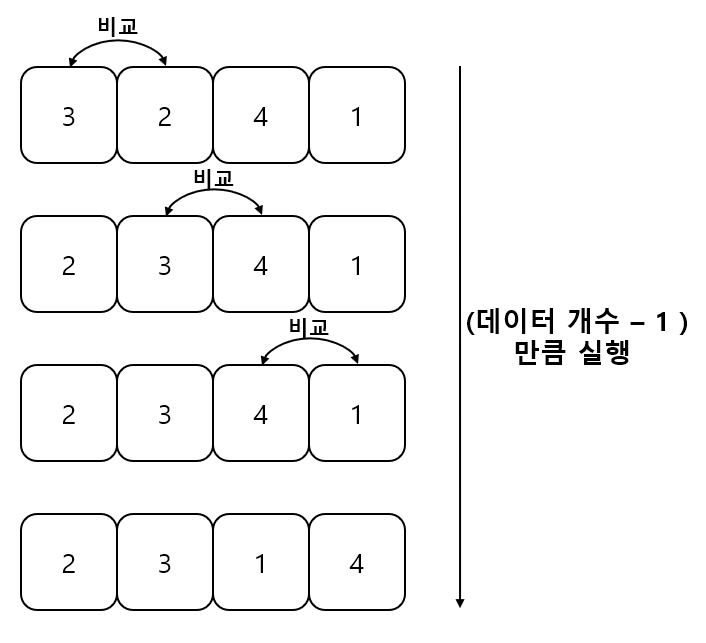
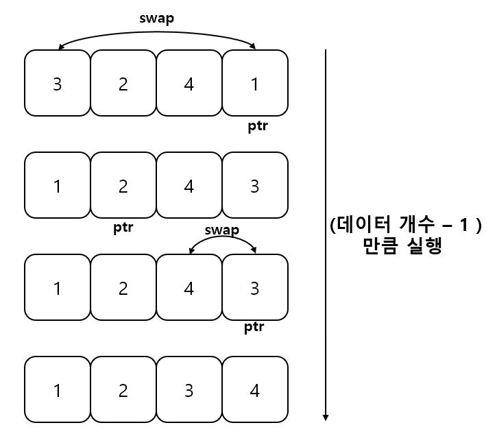
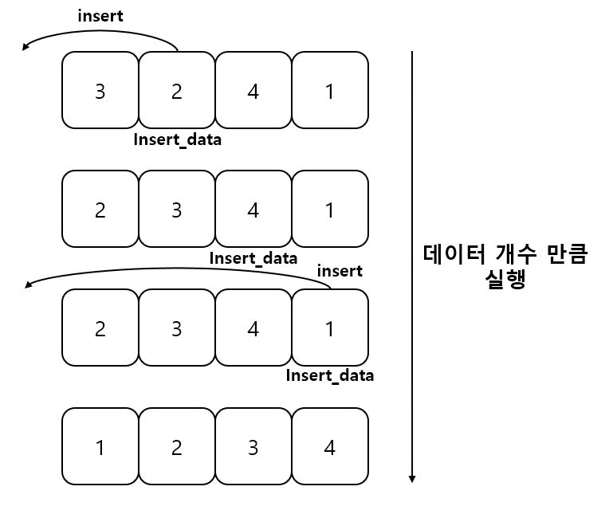
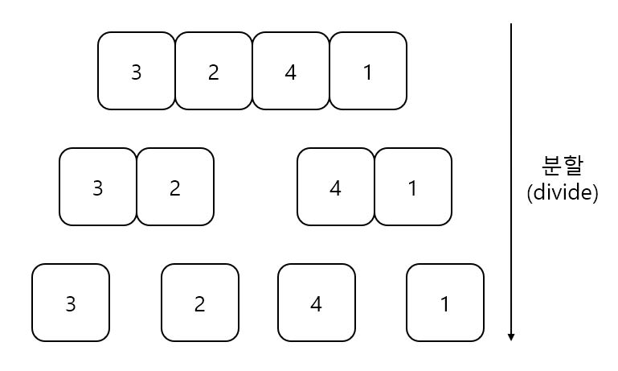
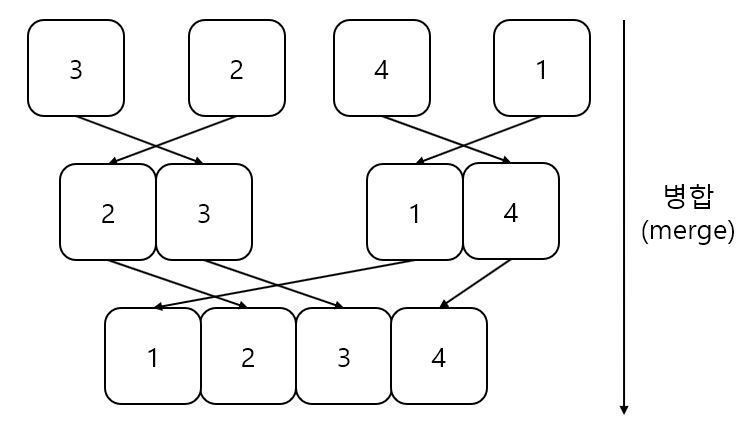
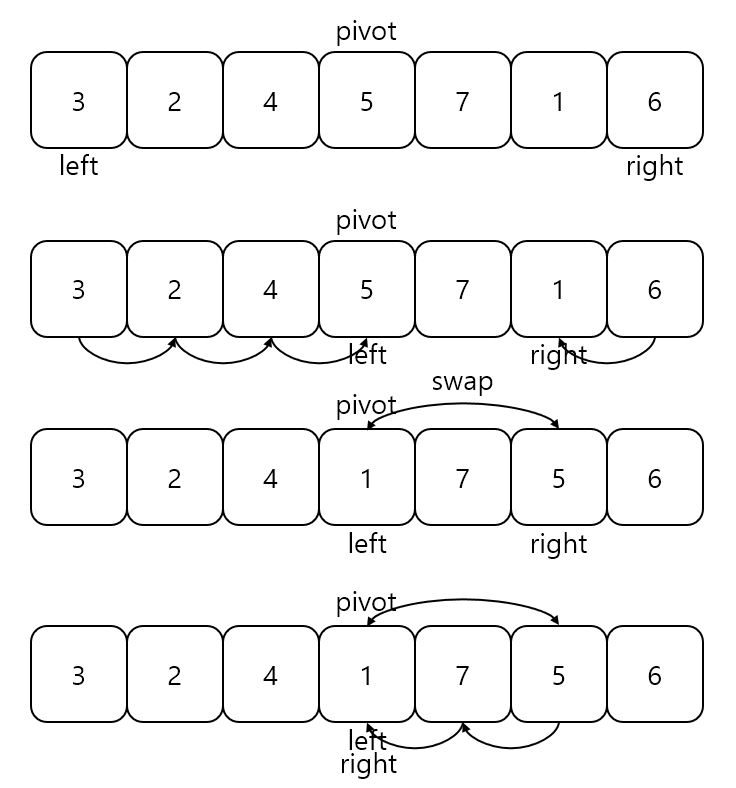
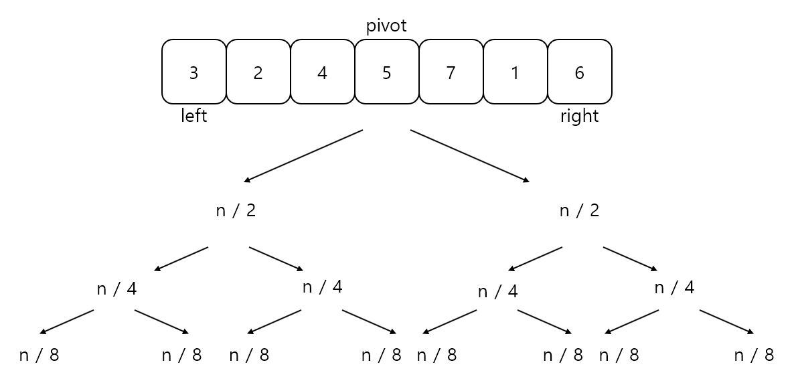

정렬
=====
- ## stablity (안정성)
-------------------
- ### 같은 값을 가진 원소끼리 swap이 되면 unstable sort, swap이 되지 않을 시 stable sort라고 부름

- ## 버블 정렬 (Bubble sort)
------------------
- ### 원리
    - #### 인접한 인덱스의 데이터끼리 비교하여 swap을 진행하는 방식이다. 우선순위가 낮은 데이터를 맨 뒤로 보내는 작업을 데이터의 개수 - 1만큼 수행한다.
    <center></center>

- ### 소스 코드 (구현)
```C++
#include <iostream>
#include <algorithm>
#include <functional>

using namespace std;

template <typename T>
void bubble_sort(T *start, T *end, function<bool(T data1, T data2)> cmp = [](T data1, T data2) { return data1 < data2; })
{
    for (T *pos = start; pos < end - 1; pos++)
    {
        for (T *pos2 = start; pos2 < end - pos + start; pos2++)
        {
            if (cmp(*(pos2 + 1), *pos2))
                swap(*pos2, *(pos2 + 1));
        }
    }
}

int main()
{
    int arr[7] = {78, 4, 6, 51, 7, 81, 14};

    bubble_sort(arr, arr + 6);

    for (const auto r : arr)
    {
        cout << r << ' ';
    }

    return 0;
}
```

- ### 성능
    - #### Big O를 계산할 때에는 보통 '비교 횟수'에 대해서 검사를 진행한다. 위 코드의 비교 연산은 if문이다. 반복문만큼 비교 횟수가 일어나므로 (n - 1) + (n - 2) + (n - 3) + ... + 1 만큼 비교 연산이 실행된다. 이 등차수열의 합은 n(n - 1) / 2이다. 즉, 버블 정렬의 Big O는 O(n^2)이다. best case는 단 한 번의 이동이 일어나지 않으나 worst case는 최악의 성능을 일으킨다.

    - #### stable sort이다.

- ## 선택 정렬 (Selection sort)
----------
- ### 원리
    - #### 기준에 맞추어서 데이터를 선택(selection)하면서 옮기는 작업을 수행하는 정렬이다.데이터를 선택하는 하나의 별도 메모리 공간이 필요하다.
    <center></center>

- ### 소스 코드 (구현)
```C++
#include <iostream>
#include <algorithm>
#include <functional>

using namespace std;

template <typename T>
void selection_sort(T *start, T *end, function<bool(const T data1, const T data2)> cmp = [](const T data1, const T data2) { return data1 < data2; })
{
    T *ptr = nullptr;

    for (T *pos = start; pos < end - 1; pos++)
    {
        ptr = pos;
        for (T *pos2 = pos + 1; pos2 < end; pos2++)
        {
            if(cmp(*pos2, *ptr))
                ptr = pos2;
        }

        swap(*pos, *ptr);
    }
}

int main()
{
    int arr[5] = {13, 11, 51, 2, 7};

    selection_sort(arr, arr + 5);

    for (const auto r : arr)
    {
        cout << r << ' ';
    }

    return 0;
}
```

- ### 성능
    - #### 데이터의 비교횟수는 버블 정렬(bubble sort)와 마찬가지로 O(n^2)이지만 이동횟수는 안쪽 for문 바깥에 존재하므로 n-1의 교환이 일어난다. 즉 비교연산에 대한 Big O는 O(n^2), 이동연산에 대한 Big O는 O(n)이다.

    - #### unstable sort이다.

- ## 삽입 정렬 (Insertion sort)
-------------
- ### 원리
    - #### 인덱스가 1인 데이터부터 앞 인덱스에서 맞는 위치를 찾아 삽입하면서 정렬하는 방식이다. 이 과정에서 데이터를 삽입하기 위해 배열을 한칸씩 미는 작업이 필요하다.
    <center></center>

- ### 소스 코드 (구현)
```C++
#include <iostream>
#include <functional>

using namespace std;

template <typename T>
void insertion_sort(T *start, T *end, function<bool(const T data1, const T data2)> cmp = [](const T data1, const T data2){ return data1 > data2; })
{
    T *insert_data = new T;

    for (T *pos = start + 1; pos < end; pos++)
    {
        T *pos2 = nullptr;
        *insert_data = *pos;

        for (pos2 = pos - 1;  pos2 >= start; pos2--)
        {
            if(cmp(*pos2, *insert_data))
                *(pos2 + 1) = *pos2;
            else
                break;
        }

        *(pos2 + 1) = *insert_data;
    }
}

int main()
{
    int arr[5] = {13, 11, 51, 2, 7};

    insertion_sort(arr, arr + 5);

    for (const auto r : arr)
    {
        cout << r << ' ';
    }

    return 0;
}
```

- ### 성능
    - #### worst case이면 안 쪽 for문의 조건을 탈출하지 못하고 끝까지 수행하므로 버블 정렬과 같은 O(n^2)의 결과가 나온다. 하지만 best case이면 O(n)의 결과가 나온다.
    - #### stable sort이다.

- ## 힙 정렬 (Heap sort)
--------------
- ### 원리
    - #### [힙(Heap)](https://github.com/Famec7/TIL/blob/main/Algorithm/Data_Sturucture/Heap.md)의 특징인 루트 노드가 가장 크다는 특징을 이용한 정렬이다. algorithm헤더에 있는 push_heap연산과 pop_heap연산을 이용하여 구현했다. push_heap은 [frist, last) 범위에 데이터를 저장하고, pop_hepa은 first 인덱스와 last - 1인덱스의 값을 교환하여 힙을 구성한다.

- ### 소스 코드 (구현)
```C++
#include <iostream>
#include <algorithm>

using namespace std;

template <typename T>
void heap_sort(T *start, T *end)
{
    for (T *pos = start + 2; pos < end; pos++)
        push_heap(start, pos);

    for (T *pos = end; pos >= start + 2; pos--)
        pop_heap(start, pos);
}

int main()
{
    int arr[5] = {13, 11, 51, 2, 7};

    heap_sort(arr, arr + 5);

    for (const auto r : arr)
    {
        cout << r << ' ';
    }

    return 0;
}
```

- ### 성능
    - #### push할 때의 시간 복잡도는 O(n*log_2 n)이고, pop을 할 때의 시간 복잡도도 O(nlog_2 n)이므로 힙 정렬의 시간 복잡도는 O(nlog_2 n)이다.

    - #### unstable sort이다.

- ## 병합 정렬 (Merge sort)
--------
- ### 원리
    - #### 분할 정복 알고리즘 (divide and conquer)을 이용하여 구현한다. 분할 정복(divide and conquer)이란 하나의 문제를 작은 문제로 나누어 해결한 후 합병하는 알고리즘이다. 보통 분할 정복을 사용하는 알고리즘은 재귀함수가 많이 나타나는 것이 특징이다.
    <center></center>
    <center></center>

- ### 소스 코드 (구현)
```C++
#include <iostream>
#include <functional>

using namespace std;

template<typename T>
void merge_(T *arr, int left, int mid, int right, function<bool(const T data1, const T data2)> cmp)
{
    T *sorted_array = new T[right + 1];
    int front_index = left;
    int rear_index = mid + 1;
    int index = left;

    while (front_index <= mid && rear_index <= right)
    {
        if(cmp(arr[front_index], arr[rear_index]))
            sorted_array[index++] = arr[front_index++];

        else
            sorted_array[index++] = arr[rear_index++];
    }

    while (rear_index <= right)
        sorted_array[index++] = arr[rear_index++];

    while (front_index <= mid)
        sorted_array[index++] = arr[front_index++];

    for (int i = left; i <= right; i++)
        arr[i] = sorted_array[i];

    delete[] sorted_array;
}

template<typename T>
void merge_sort(T *arr, int left, int right, function<bool(const T data1, const T data2)> cmp = [](const T data1, const T data2) { return data1 < data2; })
{
    if(left < right)
    {
        int mid = (left + right) / 2;

        merge_sort(arr, left, mid);
        merge_sort(arr, mid + 1, right);

        merge_(arr, left, mid, right, cmp);
    }
}

int main()
{
    int arr[5] = {13, 11, 51, 2, 7};

    merge_sort(arr, 0, sizeof(arr) / sizeof(int) - 1);

    for (const auto r : arr)
    {
        cout << r << ' ';
    }

    return 0;
}
```

- ### 성능
    - #### 비교 연산에서 비교를 위해 최대 n번의 연산을 수행하고(첫번째 while, 두번째 while), 병합을 하는 과정에서 log2n번의 연산(트리의 진행과정과 비슷)을 수행한다. 즉, 비교연산의 횟수는 nlog_2n이다. 이동 연산은 데이터를 옮기는 횟수 2n번(sorted_array와 arr)과 병합 과정 log_2n이다. 즉 병합 정렬의 시간 복잡도는 O(log_2n)이다.
    - #### stable sort이다.
    - #### best case와 worst case 모두 Big O가 같지만, 임시 메모리가 필요하다는 단점이 존재한다.

- ## 퀵 정렬(Quick sort)
--------
- ### 원리
    - #### 퀵 정렬 (quick sort)은 병합 정렬(merge sort)처럼 분할 정복 (divide and conquer) 알고리즘을 사용한다. 단, 병합 정렬(merge sort)과 달리 별도의 메모리가 필요하지 않다는 장점이 있다. 퀵 정렬(quick sort)에서 가장 중요한 점은 pivot이라는 기준점을 세운다는 점이다. 또한, pivot을 어디다 두는지에 따라 성능이 달라진다. 아래 소스 코드는Medianofthree를 이용하여 구현한 개선된 퀵정렬이다.

    - #### while문
    <center></center>

    - #### 재귀함수
    <center></center>

- ### 소스 코드 (구현)
----
```C++
#include <iostream>
#include <algorithm>
#include <functional>

using namespace std;

template <typename T>
void qsort(T *start, T *end, function<bool(const T data1, const T data2)> cmp = [](const T data1, const T data2) { return data1 < data2; })
{
    if (start >= end)
        return;
    T *pivot = (end - start) / 2 + start;
    T *left = start;
    T *right = end;

    while (left <= right)
    {
        while (cmp(*left, *pivot))
            left++;
        while (cmp(*pivot, *right))
            right--;

        if (left <= right)
        {
            swap(*left, *right);
            left++;
            right--;
        }
    }

    qsort(start, right);
    qsort(left, end);
}

int main()
{
    int arr[5] = {13, 11, 51, 2, 7};

    qsort(arr, arr + 4);

    for (const auto r : arr)
    {
        cout << r << ' ';
    }

    return 0;
}
```

- ### 성능
------
|퀵 정렬|Big O (정렬된 상태)|
|------|---|
|일반적인 퀵정렬|O(n^2)|
|Three of median - 개선된 퀵정렬|O(log_2 n)|