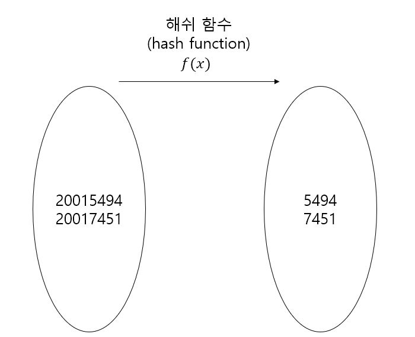
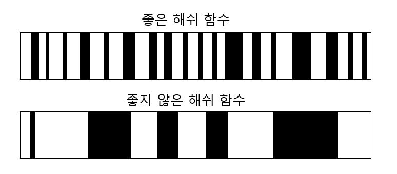
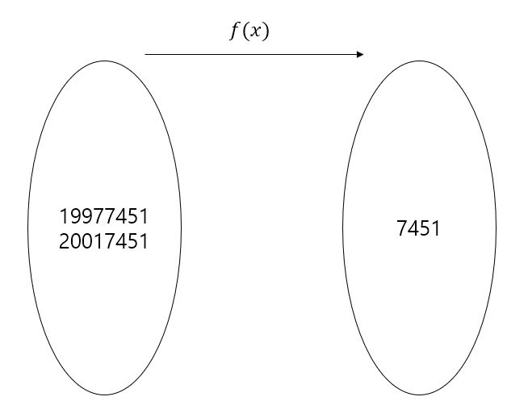
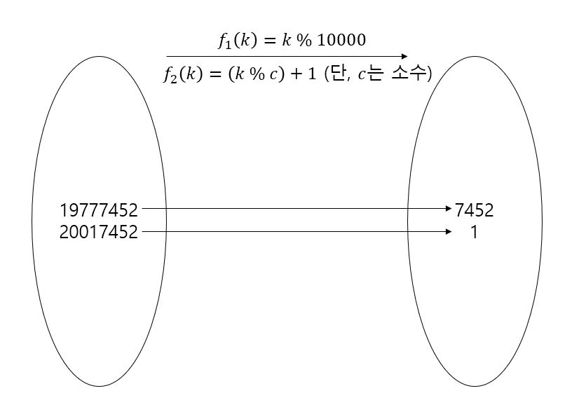

테이블 (Table)
=========
## 원리
-------
테이블(Table)의 기본 원리는 **"중복되지 않는 Key(키)와 Key(키)와 한 쌍을 이루는 Value(값)이 존재해야 한다."**이다. 즉, 모든 Key(키)는 중복되지 않으면서, 모든 Value는 하나의 Key(키)와 한 쌍을 이루어야 한다. 이러한 원리 덕분에 테이블은 O(1)이라는 압도적인 성능을 가진다. 테이블은 이런 특성 때문에 dictionary(사전) 또는map(맵)이라고 불리기도 한다.

## 해쉬 (Hash)
--------
데이터를 저장하다보면 Key(키)의 범위가 매우 많아져 인덱스 값이 커지는 경우가 발생한다. 이를 대비하여 만들어진 것이 바로 해쉬 함수 (hash function)이다. 예를 들어 8자리의 학번을 배열에 저장할 시, 해쉬 함수를 적용하지 않을 경우 최대 100000000(1억)의 인덱스가 필요하다. 하지만 학번을 뒷자리 4자리만 잘라 저장할 시, 인덱스의 범위가 절반으로 감소된다. 이처럼 데이터의 일부를 잘라 저장하는 등 데이터를 가공하는 연산을 처리하는 함수를 **해쉬 함수(hash function)**이라고 부른다.

해쉬 함수는 단순히 배열의 크기를 줄이기 위해 존재하는 것이 아니다. 밑에서 설명할 충돌(Collision)문제를 같이 해결하는 해쉬가 좋은 해쉬 함수의 조건이다.

위 그림처럼 좋은 해쉬 함수는 데이터가 골고루 분포되어 있지만, 좋지 않은 해쉬 함수를 적용하면, 데이터가 뭉쳐있는 현상이 발생한다. **즉, 충돌이 일어날 가능성이 매우 크다.**

위의 좋은 해쉬 함수를 만들기 위한 방법은 매우 많다. 또한, 데이터의 성격에 따라서 적용하는 방법이 다르다. 위에서 자릿수를 일부 추출한느 자릿수 선택(Digit Selection)도 있고, 자릿수를 접어서 모두 더하는 방식의 자릿수 폴딩(Digit Folding)의 방법도 있다. **해쉬 함수는 한 방법에 얽매여있기보단 데이터의 성격, 크기 등을 고려하여 디자인하는 것이 매우 좋다.**

## 충돌 (Collision)
---------
해쉬 함수를 디자인하다보면 아래 그림처럼 충돌(collision)이 일어나는 경우가 발생하기도 한다.

이러한 충돌은 배열을 늘리기보단 충돌을 일으키지 않게 해결책을 내놓아야한다. 해결책은 해쉬마다 다르지만, 많이 알려져 있는 선형 조사법(Linear probing)과 이차 조사법(Quadratic probing)이다.

- ### 선형 조사법 (Linear Probing)
    - #### 충돌 발생 시 비어있는 옆자리를 찾아 데이터를 저장하는 방식이다.
    - #### f(k) + 1  --> f(k) + 2 --> f(k) + 3 --> ...

- ### 이차 조사법 (Quadratic probing)
    - #### 선형 조사법(linear probing)의 단점은 충돌 횟수가 증가하면 클러스터(cluster, 집중포화) 상태가 되기 쉽다.
    - #### 선형 조사법과 달리 제곱 수를 더하여 자리를 찾는다.
    - #### f(k) + 1^2  --> f(k) + 2^2 --> f(k) + 3^2 --> ...

위 방식은 충돌이 발생 시 다른 자리에 저장하므로, 열린 어드레싱 방법(open addressing method)라고 불린다.

## 이중 해쉬 (Double Hash)
---------
이차 조사법도 클러스터 현상이 일어날 확률이 낮지 않다. 이에 대한 대안책으로 이중 해쉬(double hash)가 있다.
이중 해쉬는 말 그대로 해쉬를 이중으로 두어 적용한다. 첫 해쉬 함수는 키를 이용해 데이터의 저장위치를 찾는 함수이고, 두 번째 해쉬 함수는 충돌이 발생하였을 때 몇 칸 뒤를 저장위치로 두어야할지 정하는 함수이다. 규칙적으로 저장위치를 찾는 것보다 불규칙적으로 저장위치를 찾는 것이 클러스터 현상 방지에 더 효과적이다.

f2(k)에서 c를 소수로 두는 이유는 소수로 나머지를 구할 시 클러스터 현상이 더 감소되기 때문이다. 또한, 1을 더하는 이유는 0이 되기위함을 방지하고자 1을 더했다. 이중 해쉬를 사용함에도 충돌이 발생하는 경우에는 f2(k)에서 구한 수를 2배, 3배하여 더하는 방식으로 자리를 탐색하면 된다.