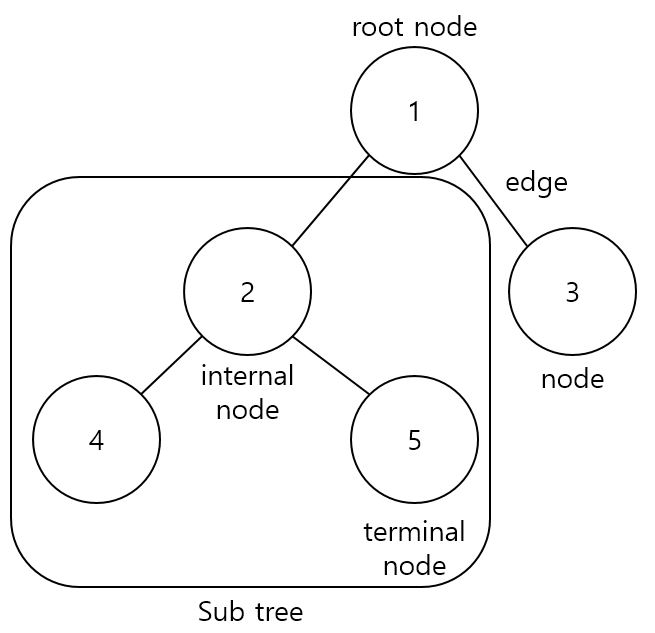

트리 (Tree)
=============
## 개념
----
- ### 비선형 구조로, 나무처럼 뻗는 모양을 가진자료구조
- ### 계층적인 관계를 표현할 때 사용된다. (Ex. 파일 시스템)

## 구조
-------

- ### 노드 (node) : &nbsp;트리의 구성요소 (Ex. 1, 2, 3...)
- ### 부모(parent) - 자식(child) 노드 : &nbsp; 서로 상하위에 있는 노드간의 관계
- ### 형제(sibling) 노드 : &nbsp; 서로 부모노드가 같은 노드간의 관계
- ### 간선 (edge) : &nbsp;노드와 노드를 연결하는 선
- ### 루트 노드 (root node) : &nbsp; 최상위 노드
- ### 딘말 노드 (terminal node) : &nbsp; 자식 노드가 없는 노드
- ### 내부 노드 (internal node) : &nbsp; 단말 노드외의 노드
- ### 서브 트리 (sub tree) : &nbsp; 상위 노드에 속하는 트리 (Ex. 2, 3, 4 노드는 루트노드의 서브트리다.)