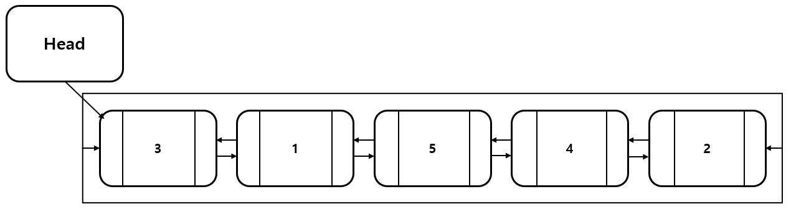
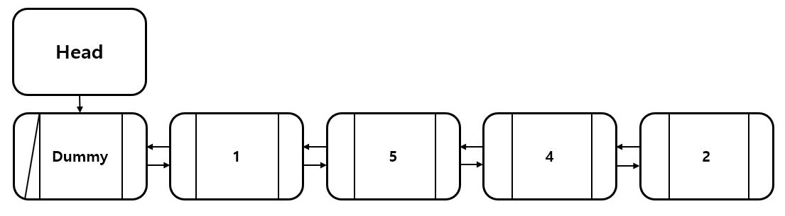

원형 연결 리스트 (Circular LinkedList)
=====================================
 

 ## 장점

 - ### 노드를 앞쪽과 뒤쪽에 추가하고 싶을 때 Tail 또는 Head 노드 하나만 있어도 추가가 가능하다.
 - ### 모든 노드를 여러번 호출할 수 있다.
 - ### 노드 추가 시 마지막 노드를 찾이위해 시간을 소비하지 않는다. 첫번째 노드의 before가 마지막 노드이기 때문이다.

 ## 단점
 - ### 노드 삭제 시 앞 노드를 가리키는 포인터가 필요하다.

 양방향(이중) 연결 리스트(Doubly LinkedList)
 ===========================================
 

 

 ## 장점

 - ### 삭제할 시 before포인터로 전 노드를 가리킬 필요가 없다.
 - ### 탐색 횟수를 훨씬 줄일 수 있다. Tail에 가까운 인덱스이면 Tail부터 탐색이 가능하고 Head에 가까운 인덱스이면 Head부터 탐색하여 횟수를 반으로 줄일 수 있다.

 ## 단점

 - ### 리스트 추가 시 메모리 사용량이 증가한다. 또한, 마지막 노드를 찾기 위해 O(n)의 시간을 사용한다.