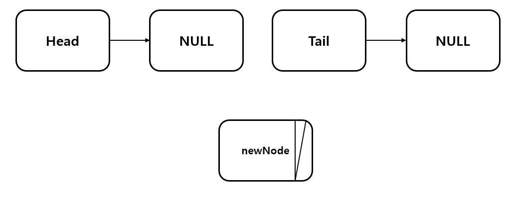

단순 연결 리스트 (LinkedList)
===============================
## 머리(Head)와 꼬리(Tail)이 있는 연결리스트
------------------------------------------
Node.h
```C++
#pragma once // Node.h

template <typename T>
class Node
{
    template<typename T1> friend class LinkedList;
private:
    T data;
    Node<T> *next = nullptr;

public:
    T GetData() const { return data; }
};
```
LinkedList.h
```C++
#ifndef __LINKEDLIST_H__ // LinkedList.h
#define __LINKEDLIST_H__
#include <iostream>
#include <functional>
using namespace std;

template <typename T>
class Node;

template <typename T>
class LinkedList
{
protected:
    Node<T> *head = nullptr;
    Node<T> *tail = nullptr;
    int opCount = 0;

public:
    void Insert(T data)
    {
        Node<T> *newNode = new Node<T>;
        newNode->data = data;
        newNode->next = nullptr;

        if (head == nullptr)
            head = newNode;

        else
            tail->next = newNode;

        tail = newNode;
        opCount++;
    }

    void InsertFront(T data)
    {
        Node<T> *newNode = new Node<T>;
        newNode->data = data;
        newNode->next = nullptr;

        if(head == nullptr){
            head = newNode;
            tail = newNode;
        }

        else
        {
            newNode->next = head;
            head = newNode;
        }

        opCount++;
    }

    int Remove(T Rdata)
    {
        Node<T> *before = nullptr;
        Node<T> *pDelete = head;

        while (pDelete != nullptr)
        {
            if (Rdata == pDelete->GetData())
            {
                before->next = pDelete->next;
                delete pDelete;
                opCount--;

                return 1;
            }

            before = pDelete;
            pDelete = pDelete->next;
        }

        return -1;
    }

    void Print()
    {
        Node<T> *ptr = head;

        while (ptr != nullptr)
        {
            cout << "Data : " << ptr->data << endl;
            ptr = ptr->next;
        }
    }

    int Search(T Sdata)
    {
        Node<T> *ptr = head;

        for (int i = 0; i < opCount; i++)
        {
            if (ptr->data == Sdata)
                return i;
            ptr = ptr->next;
        }

        return -1;
    }

    void SetSort(function<int(T &data1, T &data2)> cmp)
    {
        T tmp;
        Node<T> *ptr = head;

        for (int i = 0; i < opCount - 1; i++)
        {
            ptr = head;
            for (int j = 0; j < opCount - i - 1; j++)
            {
                if(cmp(ptr->data, ptr->next->data)){
                    tmp = ptr->data;
                    ptr->data = ptr->next->data;
                    ptr->next->data = tmp;
                }
                ptr = ptr->next;
            }
        }
    }

    int GetOpCount() const { return opCount; }
};

#endif
```
LinkedList.cpp
```C++
#include <iostream> // LinkedList.cpp
#include "Node.h"
#include "LinkedList.h"
using namespace std;

int main()
{
    LinkedList<int> list;

    list.Insert(3);
    list.Insert(1);
    list.Insert(5);
    list.Insert(2);
    list.InsertFront(4);

    auto comp = [](int &d1, int &d2) -> int{
        if(d1 > d2)
            return 1;
        return 0;
    };

    list.Print();
    cout << endl;
    cout << "Count : " << list.GetOpCount() << endl;

    int idx = list.Search(5);
    cout << "Index of Five : " << idx << endl << endl;

    int result = list.Remove(3);
    if(result)
        list.Print();
    else
        cout << "Remove Fail" << endl;
    
    cout << "Count : " << list.GetOpCount() << endl;
    cout << endl;
    list.SetSort(comp);
    list.Print();

    return 0;
}
```

- ### ADT
    > - #### void Insert(T data)
        Tail(꼬리)에 노드를 추가한다.
        
    > - #### void InsertFront(T data)
        Head(머리)에 노드를 추가한다.
    > - #### int Remove(T Rdata)
        해당하는 노드를 제거한다. 성공하면 1을 실패하면 -1을 반환한다.
    > - #### void Print()
        데이터를 모두 출력한다.
    > - #### int Search(T Sdata)
        해당하는 노드의 인덱스를 출력한다. 탐색 실패 시 -1을 반환한다.
    > - #### void SetSort(function<int(T &data1, T &data2)> cmp)
        매개변수의 정렬 기준에 맞추어 리스트를 정렬한다.
    > - #### int GetOpCount()
        노드의 개수를 출력한다.

## 머리(Head)와 더미(Dummy)가 있는 연결리스트