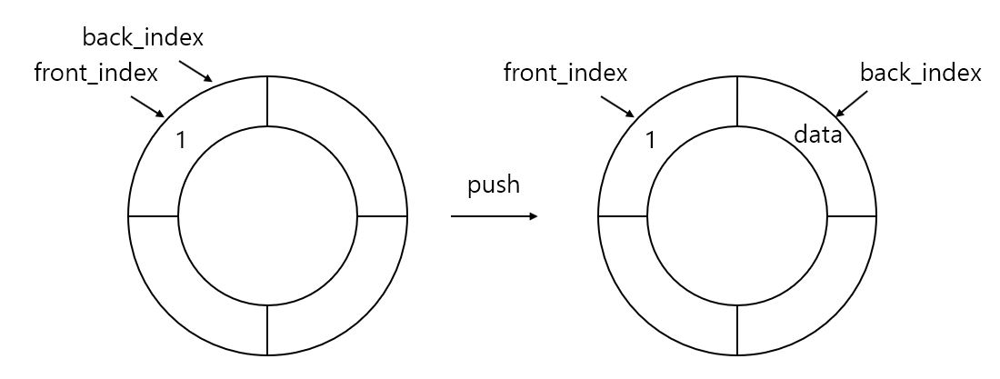

큐 (Queue)
=============
## 원리
---------------
- ### 스택(Stack)괴 달리 선입선출(First-In, First-Out; FIFO) 구조이다.
- ### Stack과 마찬가지로 배열을 이용한 큐와 연결리스트를 이용한 큐가 있다.

## 원형 큐 (Circular Queue)
-----------------
- ### 장점
    #### 일반적인 배열 큐와 달리 텅빈 상태와 꽉찬 상태를 구분할 수 있다.

- ### 단점
    #### 길이가 불변적이다.

- ### 특징
    #### 꽉 찬 상태와 텅 빈 상태를 비교하기 위해 LEN - 1만큼의 배열만 사용한다.
    #### 

CQueue.h
```C++
#pragma once
#include <iostream>
using namespace std;

#define LEN 100

template <typename T>
class Cqueue
{
private:
    T array[LEN];
    int front_index = 0;
    int back_index = 0;
    int opCnt = 0;

public:
    Cqueue() = default;

    bool empty()
    {
        if(front_index == back_index)
            return true;
        else
            return false;
    }

    void push(T data)
    {
        if((back_index + 1) % LEN == front_index)
        {
            cout << "ERROR: Memory is Full" << endl;
            exit(-1);
        }

        back_index = (back_index + 1) % LEN;
        array[back_index] = data;
        opCnt++;
    }

    void pop()
    {
        if(empty())
        {
            cout << "ERROR: Memory is not exist" << endl;
            exit(-1);
        }

        front_index = (front_index + 1) % LEN;
        
        opCnt--;
    }
    T front() const { return array[front_index]; }
    T back() const { return array[back_index]; }
    int size() const { return opCnt; }

private:
    int NextIdx(int idx)
    {
        if(idx == LEN - 1)
            return 0;
        else
            return ++idx;
    }
};
```
CQueue.cpp
```C++
#include <iostream>
#include "CQueue.h"

using namespace std;

int main()
{
    Cqueue<int> q;

    q.push(1);
    q.push(2);
    q.push(3);
    q.push(4);
    q.push(5);

    while (!q.empty())
    {
        cout << q.front() << '\t';
        q.pop();
    }
    
    return 0;
}
```

- ### ADT와 원리
    > #### bool empty()
        
    > #### void push(T data)
    <center></center>

    > #### void pop()
    > #### T front()
    > #### T back()
    > #### int size()