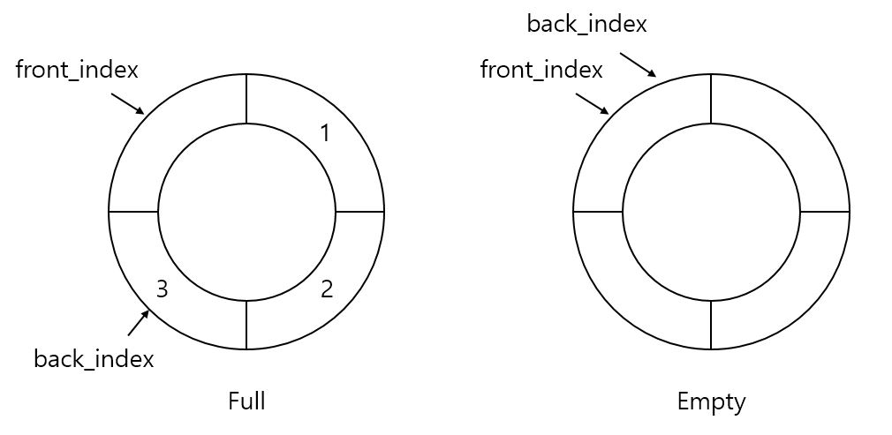
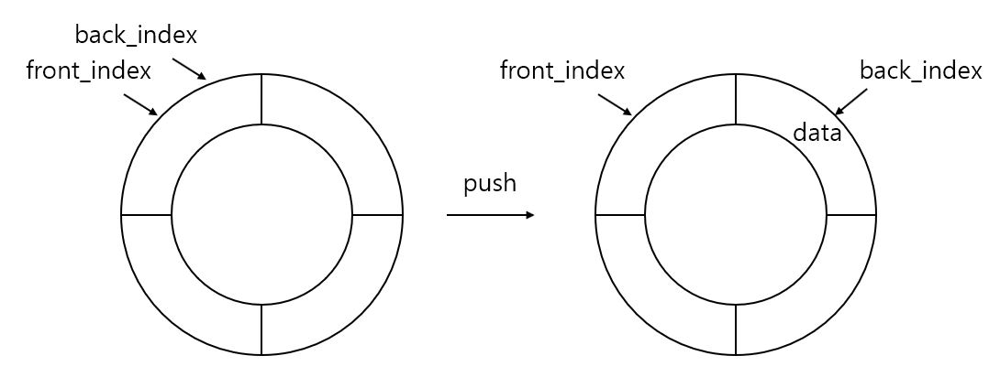
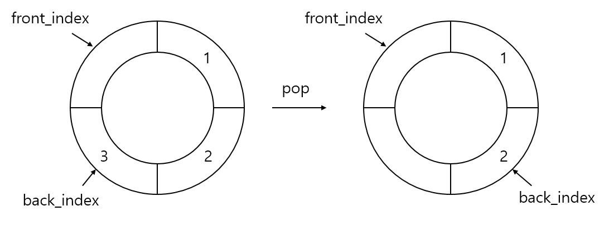
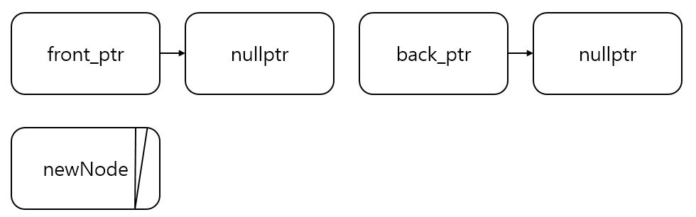
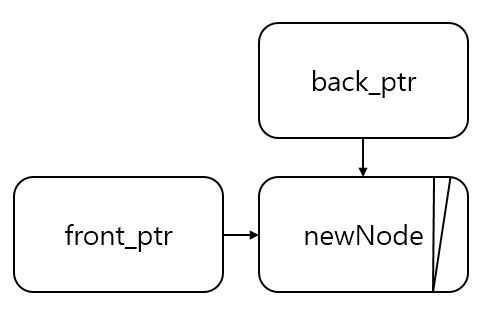
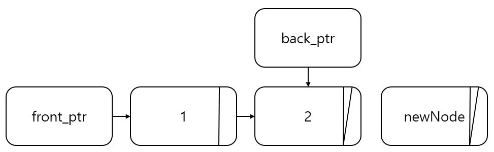
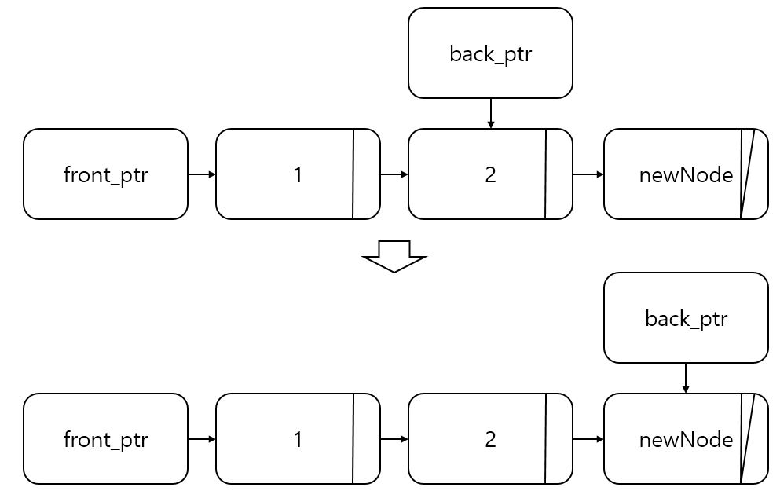
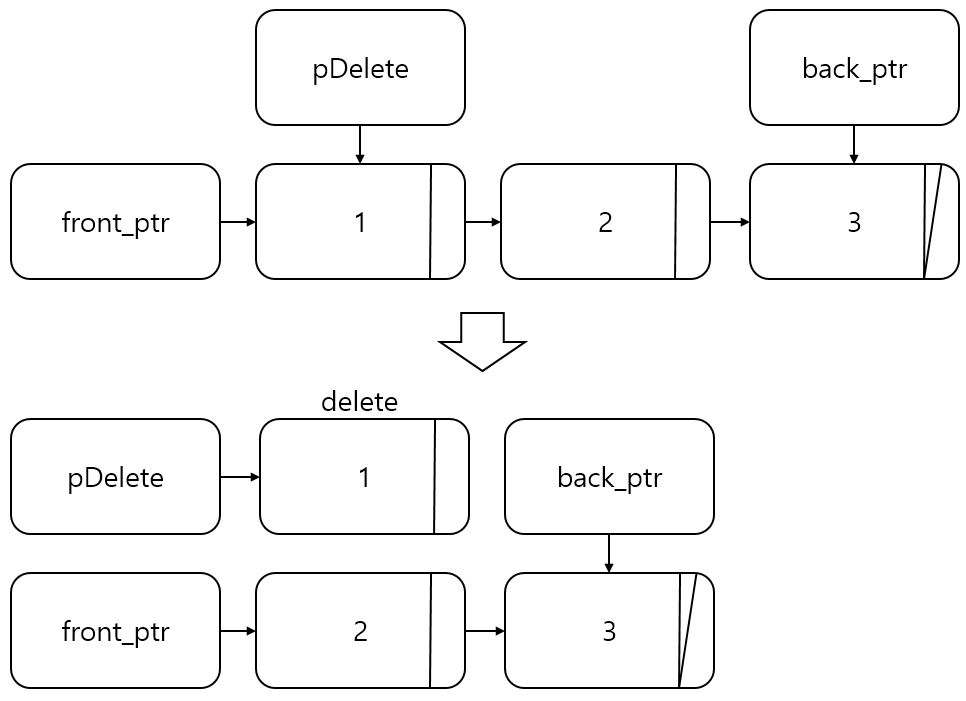

큐 (Queue)
=============
## 원리
---------------
- ### 스택(Stack)괴 달리 선입선출(First-In, First-Out; FIFO) 구조이다.
- ### Stack과 마찬가지로 배열을 이용한 큐와 연결리스트를 이용한 큐가 있다.

## 원형 큐 (Circular Queue)
-----------------
- ### 장점
    #### 일반적인 배열 큐와 달리 텅빈 상태와 꽉찬 상태를 구분할 수 있다.

- ### 단점
    #### 길이가 불변적이다.

- ### 특징
    #### 꽉 찬 상태와 텅 빈 상태를 비교하기 위해 LEN - 1만큼의 배열만 사용한다.

CQueue.h
```C++
#pragma once
#include <iostream>
using namespace std;

#define LEN 100

#pragma once
#include <iostream>
using namespace std;

#define LEN 100

template <typename T>
class Cqueue
{
private:
    T array[LEN];
    int front_index = 0;
    int back_index = 0;
    int opCnt = 0;

public:
    Cqueue() = default;

    bool empty()
    {
        if(front_index == back_index)
            return true;
        else
            return false;
    }

    void push(T data)
    {
        if((back_index + 1) % LEN == front_index)
        {
            cout << "ERROR: Memory is Full" << endl;
            exit(-1);
        }

        back_index = (back_index + 1) % LEN;
        array[back_index] = data;
        opCnt++;
    }

    void pop()
    {
        if(empty())
        {
            cout << "ERROR: Memory is not exist" << endl;
            exit(-1);
        }

        front_index = (front_index + 1) % LEN;
        opCnt--;
    }

    T front()
    {
        if(front_index == 0)
            front_index++;
        
        return array[front_index];
    }

    T back()
    {
        if(back_index == 0)
            back_index++;

        return array[back_index];
    }

    int size() const { return opCnt; }
};
```
CQueue.cpp
```C++
#include <iostream>
#include "CQueue.h"

using namespace std;

int main()
{
    Cqueue<int> q;

    q.push(1);
    q.push(2);
    q.push(3);
    q.push(4);
    q.push(5);

    while (!q.empty())
    {
        cout << q.front() << '\t';
        q.pop();
    }
    
    return 0;
}
```

- ### ADT와 원리
    > #### bool empty()
    <center></center>
        
    > #### void push(T data)
    <center></center>

    > #### void pop()
    <center></center>

    > #### T front()
    ##### front_index의 값을 반환

    > #### T back()
    ##### back_index의 값을 반환

    > #### int size()
    ##### 큐에 채워진 값의 개수를 반환  

## 연결리스트 기반 큐
----------------------------
- ### 장점
    - #### 길이가 가변적이다.
    - #### 원형 큐와 달리 텅빈 상태와 꽉찬 상태를 구분하기 위한 고려를 하지 않아도 된다.
- ### 단점
    - #### 탐색하는데 O(n)의 시간이 걸린다.

Node.h
```C++
#pragma once

template <typename T>
class Node
{
    template <typename T1> friend class Queue;
private:
    T data;
    Node<T> *next = nullptr;

public:
    T GetData() const { return data; }
};
```
LQueue.h
```C++
#pragma once
#include <iostream>
#include "Node.h"

using namespace std;

template <typename T>
class Node;

template <typename T>
class Queue
{
private:
    T data;
    Node<T> *front_ptr = nullptr;
    Node<T> *back_ptr = nullptr;
    int count = 0;

public:
    bool empty() const
    {
        if (front_ptr == nullptr)
            return true;
        else
            return false;
    }

    void push(T data)
    {
        Node<T> *newNode = new Node<T>;
        newNode->data = data;

        if (empty())
        {
            front_ptr = newNode;
            back_ptr = newNode;
        }

        else
        {
            back_ptr->next = newNode;
            back_ptr = newNode;
        }

        count++;
    }

    void pop()
    {
        Node<T> *pDelete = nullptr;
        
        if(empty())
        {
            cout << "ERROR: Memory Is Not Exist" << endl;
            exit(-1);
        }

        pDelete = front_ptr;
        front_ptr = front_ptr->next;

        delete pDelete;

        count--;
    }

    T front() const { return front_ptr->data; }
    T back() const { return back_ptr->data; }

    int size() const { return count; }
};
```
```C++
#include <iostream>
#include "LQueue.h"

using namespace std;

int main()
{
    Queue<int> q;

    q.push(1);
    q.push(2);
    q.push(3);
    q.push(4);
    q.push(5);

    while (!q.empty())
    {
        cout << q.front() << endl;
        q.pop();
    }
    
    return 0;
}
```

- ### ADT와 원리
    > #### bool empty()
    ##### front_ptr이 NULL을 가리키면 비어있는 상태
        
    > #### void push(T data)
    ##### 첫 노드를 추가할 때
    <center></center>
    <center></center>

    ##### 첫 노드 추가 이후
    <center></center>
    <center></center>

    > #### void pop()
    <center></center>

    > #### T front()
    ##### front_ptr이 가리키는 값을 반환

    > #### T back()
    ##### back_ptr이 가리키는 값을 반환

    > #### int size()
    ##### 큐에 채워진 값의 개수를 반환