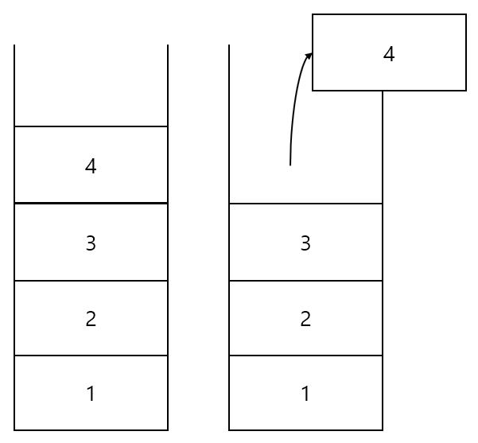

스택 (Stack)
=============
## 원리
------------------------------
- ### Stack의 '쌓아올리다'라는 뜻 그래도 아래부터 쌓아올리고 위에서부터 나오는 구조
- ### Last-In, First-Out (후입선출)의 구조를 가짐

<center></center>

## ADT

- ### bool IsEmpty() : &nbsp;스택이 비어있으면 1, 아니면 0을 반환
- ### void push() : &nbsp;스택에 데이터를 넣기(Push)
- ### T pop() : &nbsp;스택에 데이터를 꺼내기(pop) -> 삭제 후 반환
- ### T peek() : &nbsp;가장 위에 있는 값(top Index)을 반환

## 배열 기반 Stack
ArrayStack.h
```C++
#pragma once
#include <iostream>
using namespace std;

#define LEN 100

template <typename T>
class Stack
{
private:
    T Array[LEN];
    int topIndex = -1;

public:
    bool IsEmpty()
    {
        if(topIndex == -1)
            return true;
        else
            return false;
    }

    void push(T data)
    {
        if(topIndex >= LEN)
        {
            cout << "ERROR : MEMORY IS FULL" << endl;
            exit(-1);
        }

        Array[++topIndex] = data;
    }

    T pop()
    {
        if(IsEmpty())
        {
            cout << "EEROR : STACK IS EMPTY" << endl;
            exit(-1);
        }

        return Array[topIndex--];
    }
    
    T peek()
    {
        if(IsEmpty())
        {
            cout << "EEROR : NOT EXIST" << endl;
            exit(-1);
        }
        
        return Array[topIndex];
    }
};
```
ArrayStack.cpp
```C++
#include <iostream>
#include "ArrayStack.h"

using namespace std;

int main()
{
    Stack<int> stack;

    stack.push(1);
    stack.push(2);
    stack.push(3);
    stack.push(4);
    stack.push(5);

    cout << "Top Data : " << stack.peek() << endl;

    while (!stack.IsEmpty())
    {
        cout << stack.pop() << endl;
    }

    return 0;
}
```

## 연결리스트 기반 Stack
Node.h
```C++
#pragma once

template <typename T>
class Node
{
    template<typename T1> friend class Stack;
private:
    T data;
    Node<T> *next = nullptr;
};

```
ListStack.h
```C++
#pragma once
#include <iostream>
using namespace std;

template <typename T>
class Node;

template <typename T>
class Stack
{
private:
    Node<T> *head = nullptr;

public:
    bool IsEmpty()
    {
        if (head == nullptr)
            return true;
        else
            return false;
    }

    void push(T data)
    {
        Node<T> *newNode = new Node<T>;

        newNode->data = data;
        newNode->next = head;

        head = newNode;
    }

    T pop()
    {
        T rData;
        Node<T> *pDelete = nullptr;

        if (IsEmpty())
        {
            cout << "EEROR : STACK IS EMPTY" << endl;
            exit(-1);
        }

        rData = head->data;
        pDelete = head;

        head = head->next;
        free(pDelete);
        return rData;
    }

    T peek()
    {
        if (IsEmpty())
        {
            cout << "EEROR : NOT EXIST" << endl;
            exit(-1);
        }
        
        return head->data;
    }
};
```
ListStack.cpp
```C++
#include <iostream>
#include "Node.h"
#include "ListStack.h"

using namespace std;

int main()
{
    Stack<int> stack;

    stack.push(1);
    stack.push(2);
    stack.push(3);
    stack.push(4);
    stack.push(5);

    cout << "Top Data : " << stack.peek() << endl;

    while (!stack.IsEmpty())
    {
        cout << stack.pop() << endl;
    }

    return 0;
}
```